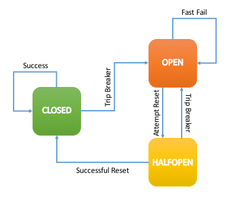

[](https://travis-ci.com/IBM-Swift/CircuitBreaker)


# CircuitBreaker
The Circuit Breaker design pattern is used to increase application stability, improve response time, and prevent the application from making constant failing requests. This library provides the tools needed to bring Circuit Breaker logic to your Swift applications.



## Contents
* [Installation](#installation)
* [Basic Usage](#basic-usage)
* [Advanced Usage](#advanced-usage)
* [API](#api)

## Swift version
The latest version of CircuitBreaker works with the `3.1.1` and newer version of the Swift binaries. You can download this version of the Swift binaries by following this [link](https://swift.org/download/#releases).

## Installation
To leverage the CircuitBreaker package in your Swift application, you should specify a dependency for it in your `Package.swift` file:

```swift
 import PackageDescription

 let package = Package(
     name: "MySwiftProject",

     ...

     dependencies: [
         // Swift 3
         .Package(url: "https://github.com/IBM-Swift/CircuitBreaker.git", majorVersion: 2),

         // Swift 4
         .package(url: "https://github.com/IBM-Swift/CircuitBreaker.git", .upToNextMajor(from: "2.0.0")),
         ...

     ])
 ```

### Basic Usage

*In this form of usage, the CircuitBreaker state is based on timeouts only.*

If the function you are circuit breaking makes an asynchronous call(s) and the execution time of that call should be taking into account, then see [`Advanced Usage`](#advanced-usage) below.

1. Define a fallback function with the signature `(<BreakerError, (fallbackArg1, fallbackArg2,...)>) -> Void`:
```swift
func myFallback(err: BreakerError, msg: String) {
    // The fallback will be called if the request does not return before the specified timeout
    // or if the CircuitBreaker is currently in Open state and set to fail fast.
    // Client code can use the fallback function to do alternate processing, such as show an error page.
    Log.verbose("Error: \(error)")
    Log.verbose("Message: \(msg)")
}
```

2. Create a function to circuit break:
```swift
func myFunction(a: Int, b: Int) -> Int {
    // do stuff
    let value: Int = ...
    return value
}
```

3. Create a CircuitBreaker instance for each endpoint you wish to circuit break:
  * Must specify the fallback function, and the endpoint to circuit break
  * Optional configurations include: timeout, resetTimeout, maxFailures, and bulkhead
```swift
let breaker = CircuitBreaker(command: myFunction, fallback: myFallback)
```

4. Invoke the call to the function by calling the CircuitBreaker `run()` method. You should pass the corresponding arguments for the command and fallback closures. In this sample, `myFunction` takes two integers as parameters while `myFallback` takes a string as its second parameter:

```swift
breaker.run(commandArgs: (a: 10, b: 20), fallbackArgs: (msg: "Something went wrong."))
```

 * May be called multiple times with varied input:
```swift
breaker.run(commandArgs: (a: 15, b: 35), fallbackArgs: (msg: "Something went wrong."))
```

Full Implementation:
```swift
...

func myFallback(err: BreakerError, msg: String) {
    // The fallback will be called if the request does not return before the specified timeout
    // or if the CircuitBreaker is currently in Open state and set to fail fast.
    // Client code can use the fallback function to do alternate processing, such as show an error page.
    Log.verbose("Error: \(error)")
    Log.verbose("Message: \(msg)")
}

func myFunction(a: Int, b: Int) -> Int {
    // do stuff
    let value: Int = ...
    return value
}

let breaker = CircuitBreaker(command: myFunction, fallback: myFallback)

breaker.run(commandArgs: (a: 10, b: 20), fallbackArgs: (msg: "Something went wrong."))
breaker.run(commandArgs: (a: 15, b: 35), fallbackArgs: (msg: "Something went wrong."))

...
```

### Advanced Usage

*In this form of usage, the CircuitBreaker state is based on timeouts and user defined failures (quite useful when the function you are circuit breaking makes an asynchronous call).*

1. Define a fallback function with the signature `(<BreakerError, (fallbackArg1, fallbackArg2,...)>) -> Void`:
```swift
func myFallback(err: BreakerError, msg: String) {
    // The fallback will be called if the request does not return before the specified timeout
    // or if the CircuitBreaker is currently in Open state and set to fail fast.
    Log.verbose("Error: \(error)")
    Log.verbose("Message: \(msg)")
}
```

2. Create a context function for the logic you intend to circuit break (this allows you to alert the CircuitBreaker of a failure or a success). Please note that a context function receives an `Invocation` object as its parameter. An instance of the `Invocation` class states 1) the parameter types that must be passed to the context function, 2) the return type from the execution of the context function, and 3) parameter type used as the second argument for the fallback closure:

```swift
func myContextFunction(invocation: Invocation<(String), Void, String>) {
  let requestParam = invocation.commandArgs
  // Create HTTP request
  guard let url = URL(string: "http://mysever.net/path/\(requestParam)") else {
    // Something went wrong...

    ...

    invocation.notifyFailure()
  }

  var req = URLRequest(url: url)
  req.httpMethod = "GET"
  req.allHTTPHeaderFields = ["Content-Type": "application/json"]
  let session = URLSession.shared

  // Perform Request
  session.dataTask(with: req) { result, res, err in
    guard let result = result else {
      // Failed getting a result from the server

      ...

      invocation.notifyFailure()
      return
    }

    // Convert results to a JSON object
    let json = JSON(data: result)
    // Process JSON data

    ...

    invocation.notifySuccess()
  }.resume()
}
```

3. Create a CircuitBreaker instance for each context function (e.g. endpoint) you wish to circuit break:
  * Must specify the fallback function and the endpoint to circuit break
  * Optional configurations include: timeout, resetTimeout, maxFailures, rollingWindow, and bulkhead
```swift
let breaker = CircuitBreaker(contextCommand: myContextFunction, fallback: myFallback)
```

4. Invoke the call to the endpoint by calling the CircuitBreaker `run()` method. You should pass the corresponding arguments for the context command and fallback closures. In this sample, `myContextFunction` takes a string as its parameter while `myFallback` takes a string as its second parameter:

```swift
let id: String = ...
breaker.run(commandArgs: id, fallbackArgs: (msg: "Something went wrong."))
```

Full Implementation:

```swift
...

func myFallback(err: BreakerError, msg: String) {
    // The fallback will be called if the request does not return before the specified timeout
    // or if the CircuitBreaker is currently in Open state and set to fail fast.
    Log.verbose("Error: \(error)")
    Log.verbose("Message: \(msg)")
}

func myContextFunction(invocation: Invocation<(String), Void, String>) {
  let requestParam = invocation.commandArgs
  // Create HTTP request
  guard let url = URL(string: "http://mysever.net/path/\(requestParam)") else {
    // Something went wrong...

    ...

    invocation.notifyFailure()
  }

  var req = URLRequest(url: url)
  req.httpMethod = "GET"
  req.allHTTPHeaderFields = ["Content-Type": "application/json"]
  let session = URLSession.shared

  // Perform Request
  session.dataTask(with: req) { result, res, err in
    guard let result = result else {
      // Failed getting a result from the server

      ...

      invocation.notifyFailure()
      return
    }

    // Convert results to a JSON object
    let json = JSON(data: result)
    // Process JSON data

    ...

    invocation.notifySuccess()
  }.resume()
}

let breaker = CircuitBreaker(contextCommand: myContextFunction, fallback: myFallback)

let id: String = ...
breaker.run(commandArgs: id, fallbackArgs: (msg: "Something went wrong."))

...
```

## API
### CircuitBreaker

#### Basic Usage Constructor
```swift
CircuitBreaker(timeout: Int = 1000, resetTimeout: Int = 60000, maxFailures: Int = 5, rollingWindow: Int = 10000, bulkhead: Int = 0, command: @escaping AnyFunction<A, B>, fallback: @escaping AnyFallback<C>)
```

#### Advanced Usage Constructor
```swift
CircuitBreaker(timeout: Int = 1000, resetTimeout: Int = 60000, maxFailures: Int = 5, rollingWindow: Int = 10000, bulkhead: Int = 0, contextCommand: @escaping AnyContextFunction<A, B>, fallback: @escaping AnyFallback<C>)
```

#### Constructor parameters
 * `timeout` Amount in milliseconds that your function should complete before the invocation is considered a failure. Default is set to 1000 milliseconds.
 * `resetTimeout` Amount in milliseconds to wait before setting to halfopen state. Default is set to 60000 milliseconds.
 * `maxFailures` Number of failures allowed within `rollingWindow` before setting state to open. Default is set to 5.
 * `rollingWindow` Time window in milliseconds where the maximum number of failures must occur to trip the circuit. For instance, say `maxFailures` is 5 and `rollingWindow` is 10000 milliseconds. In such case, for the circuit to trip, 5 invocation failures must occur in a time window of 10 seconds, even if these failures are not consecutive. Default is set to 10000 milliseconds.
 * `bulkhead` Number of the limit of concurrent requests running at one time. Default is set to 0, which is equivalent to not using the bulkheading feature.
 * `fallback` Function user specifies to signal timeout or fastFail completion. Required format: `(BreakerError, (fallbackArg1, fallbackArg2,...)) -> Void`
 * `command` Function to circuit break (basic usage constructor).
 * `contextCommand` Contextual function to circuit break, which allows user defined failures (the context provides an indirect reference to the corresponding circuit breaker instance; advanced usage constructor).

### Stats
```swift
...
// Create CircuitBreaker
let breaker = CircuitBreaker(command: myFunction, fallback: myFallback)

// Invoke breaker call
breaker.run(commandArgs: (a: 10, b: 20), fallbackArgs: (msg: "Something went wrong."))

// Log Stats snapshot
breaker.snapshot()
...
```

#### Tracked Stats:
 * Total Requests
 * Concurrent Requests
 * Rejected Requests
 * Successful Responses
 * Average Response Time
 * Failed Responses
 * Total Timeouts
 * Total Latency

## License
This Swift package is licensed under Apache 2.0. Full license text is available in [LICENSE](LICENSE).
