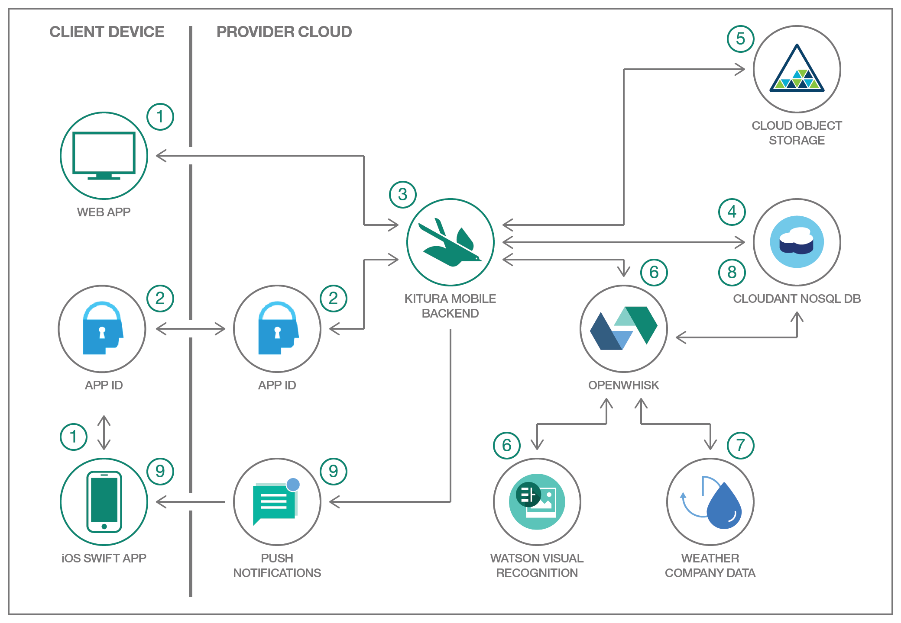

# About BluePic

## Project folder structure

These are the main folders in this repo:

* `./BluePic-iOS` - Contains the iOS client application.
* `./BluePic-Server` - Contains the Kitura-based server application and its dependencies. This folder contains the artifacts that are deployed to IBM Cloud.
* `./BluePic-Cloud-Functions` - Contains the Cloud Functions actions and sequence code written in Swift.
* `./Bridge-Scripts` - Contains the scripts to be leveraged by the IBM Cloud Tools for Swift.
* `./Docs` - Contains additional project documentation.
* `./Imgs` - Contains images referenced in this `README` file.

## Swift packages

The following Swift packages are used in BluePic:

- [Kitura-CouchDB](https://github.com/IBM-Swift/Kitura-CouchDB)
- [Kitura](https://github.com/IBM-Swift/Kitura.git)
- [Cloud Configuration](https://github.com/IBM-Swift/CloudConfiguration.git)
- [Swift SDK for IBM Cloud Object Storage Service](https://github.com/ibm-bluemix-mobile-services/bluemix-objectstorage-swift-sdk.git)
- [Kitura Credentials plugin for the App ID service](https://github.com/ibm-cloud-security/appid-serversdk-swift)
- [Swift SDK for IBM Cloud Push Notifications Service](https://developer.ibm.com/code/patterns/apply-cognitive-to-mobile-images-on-the-go/)

## Architecture
The following diagram captures the architecture for the BluePic app:

Figure 1. BluePic Architecture Diagram.

### Application Workflow
1. A client from an iOS device or web browser connects to the Kitura Mobile Backend
2. The clients are optionally able to authenticate. On the iOS devices they leverage the AppID service in Bluemix.
3. At this point a client is able to take a picture (on the iOS client) and upload the image (on both clients).
4. The Kitura Mobile Backend will first create an entry in a Cloudant NoSQL DB.
5. The Kitura Mobile Backend will then store the file in the Bluemix Cloud Object Storage.
6. OpenWhisk actions are triggered with Kitura writes into Cloudant DB and Object Storage then triggered. These actions include invoking the Watson Visual Recognition service to analyze the image.
7. In parallel, OpenWhisk also gets location data from where the image was taken, from the Bluemix Weather Company Data service.
8. OpenWhisk will take the returned data from AlchemyAPI and the Weather Company Data services and update the Cloudant NoSQL DB entry.
9. Finally, OpenWhisk will trigger a Bluemix Push Notification event for the iOS client.