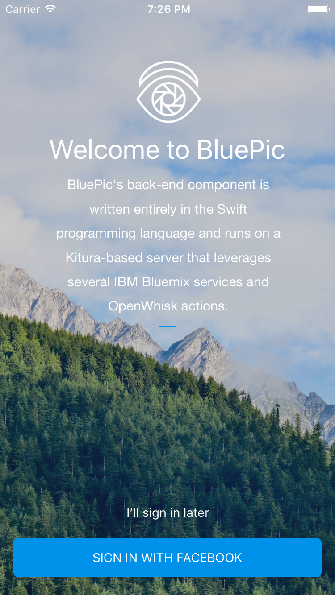
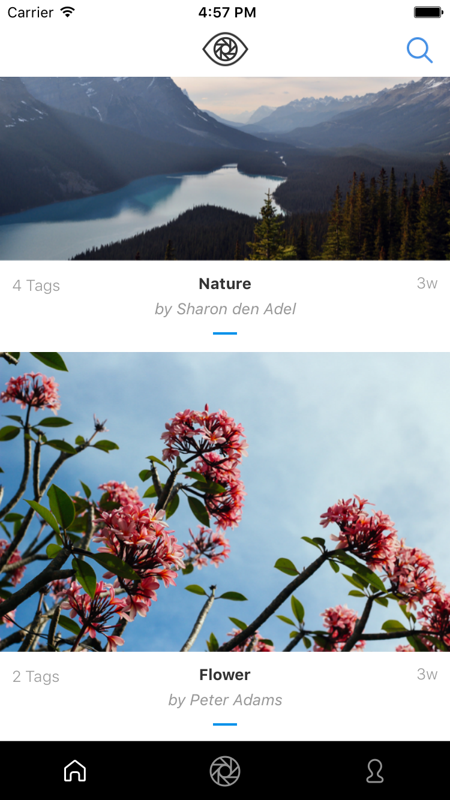
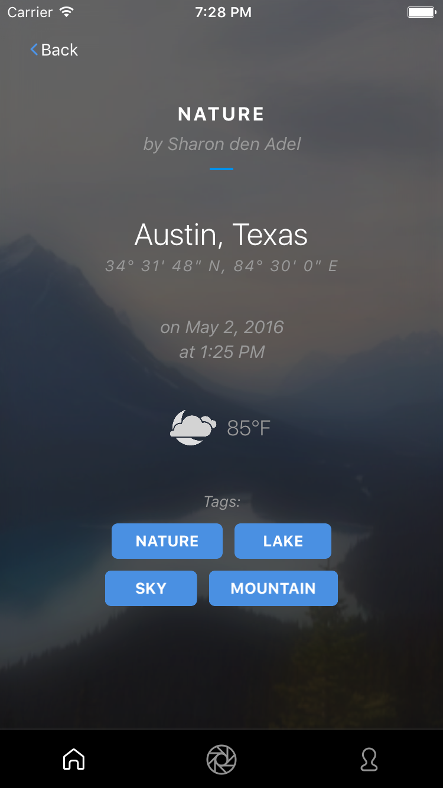
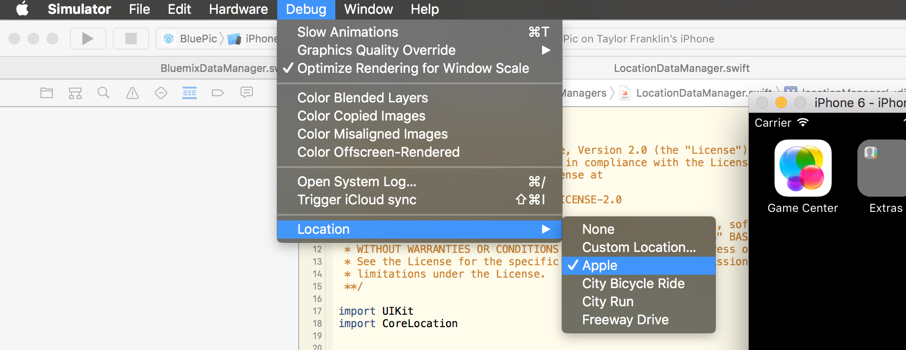
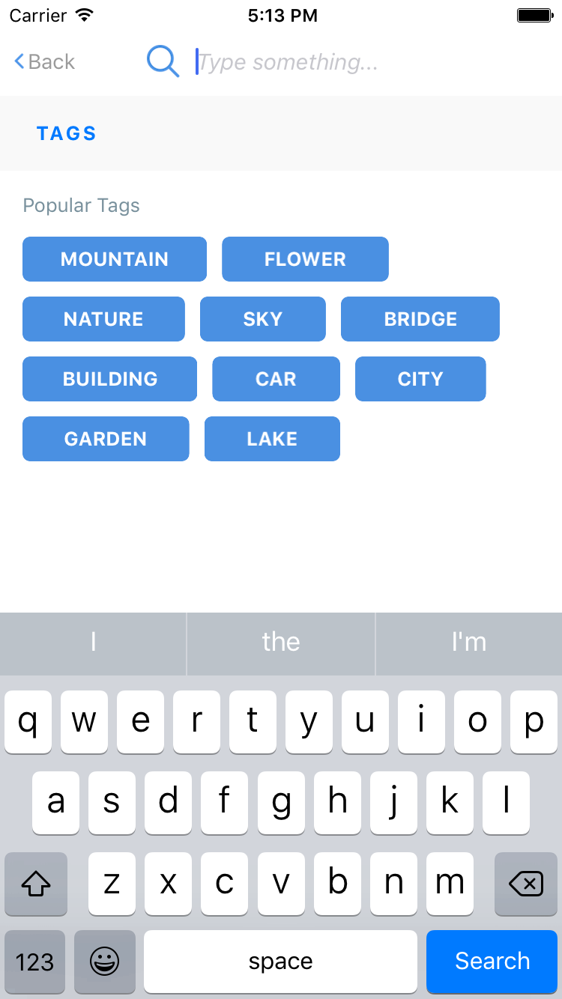
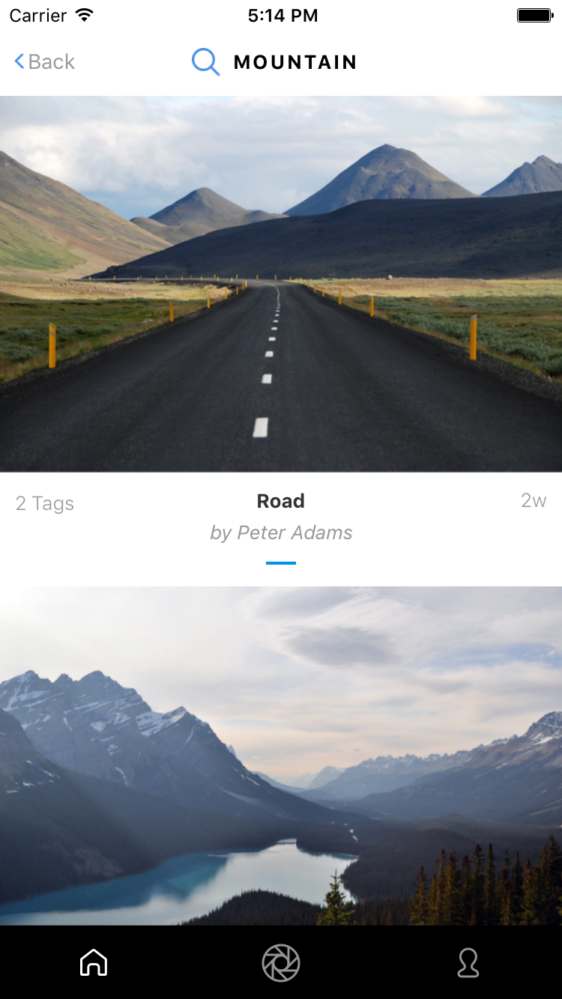

## Using BluePic

BluePic was designed so that anyone can quickly launch the app and view photos posted without needing to log in. However, to view the profile or post photos, the user can easily login with his/her Facebook. This is only used to uniquely identify the user by obtaining the Facebook ID and the user's full name.

Figure 1. Welcome page.

 

### View Feed

The feed (first tab) shows all the latest photos posted to the BluePic community (regardless if logged in or not).

Figure 2. Main feed view.

### View Image Details

You get here by simply tapping on an image. You will be shown a collection of information, including caption, author, location of photo, time taken, weather at location, and associated tags. Both, weather and tag info are determined server-side on Bluemix with Insights for Weather and Alchemy Vision.

Figure 3. Image detail view.

### Post a Photo

Posting to the BluePic community is easy. Tap the middle tab in the tab bar and choose to either pick a photo from the camera roll or take a photo using the device's camera. You can optionally enter a caption before posting the picture.

Figure 4. Posting a photo.

Please note that while trying to post a photo using the iOS simulator, the app may not be able to obtain your location. To fix this simulator specific issue, simply select any location in the simulator's debug menu:

Figure 5. Set simulated location

If selecting a location doesn't fix the issue, try toggling the location to None and then back to a location for the simulator to successfully simulate a location. Remember this may have to be done for each launch of the iOS simulator. Running BluePic on a physical device avoids this issue entirely.

### View Profile

By tapping the third tab, you can view your profile. This shows your Facebook profile photo, lists how many photos you've posted, and shows all the photos you've posted to BluePic.

Figure 6. Profile feed.

### View Popular Tags

By tapping on the magnifing glass icon on feed view, we can navigate to the search page where we can enter text and perform a search against different tagged images or we can view the 10 most popular tags and search by one of those.

Figure 7. Popular tags and search.

### View Search Results

Once the search has been performed, all the results are listed in a view just like the feed view, but this view will only show items that match the search tag.

Figure 8. Search results.

