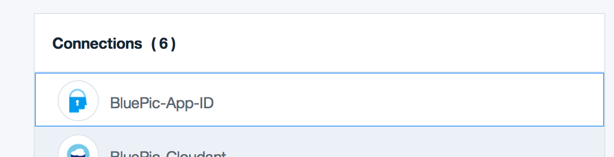
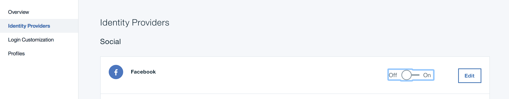
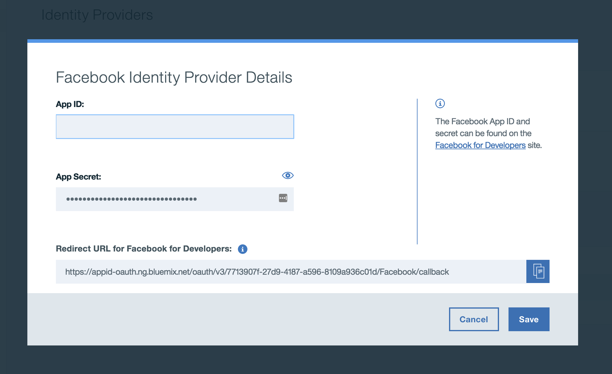
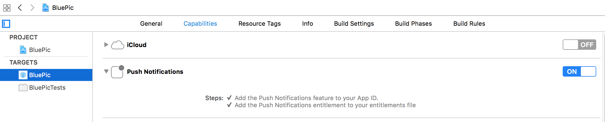

# BluePic

[](https://travis-ci.org/IBM/BluePic)


BluePic은 사진을 찍어서 다른 BluePic 사용자와 사진을 공유할 수 있는 사진 및 이미지 공유를 위한 샘플 애플리케이션입니다. 이 샘플 애플리케이션은 모바일 iOS 애플리케이션에서 Swift로 작성된 Kitura기반 서버 애플리케이션을 활용하는 방법을 보여줍니다.

BluePic은Swift 언어 기반의 애플리케이션으로, iOS 클라이언트 개발 뿐 아니라, 서버 사이드에서도 Kitura라는Swift 기반 웹 프레임워크 및 HTTP 서버를 활용합니다. Bluepic의 흥미로운 기능은 서버에서 사진을 처리하는 방식입니다. 이미지가 포스팅되면 기록이Cloudant에 저장되고, 이미지 바이너리는 Object Storage에 저장됩니다.  거기에서  [OpenWhisk](http://www.ibm.com/cloud-computing/bluemix/openwhisk/) 시퀀스가 호출되어 이미지가 업로드 된 해당 위치의 온도와 현재 날씨 상태 (예: 맑음, 흐림 등)과 같은 기상 정보가 계산됩니다. Watson Visual Recognition은 OpenWhisk 시퀀스에서, 이미지를 분석하고 이미지로 부터 텍스트 태그를 추출하는데 사용됩니다. 마지막으로 푸시 알림이 사용자에게 전송되어 이미지가 처리되었으며 날씨와 텍스트 태그 데이터가 포함되었음을 알려줍니다.

## Swift 버전
본 예제에서 사용된 백엔드 구성요소(예: Kitura 기반 서버와 OpenWhisk 액션)와 BluePic 애플리케이션의 iOS 구성요소는 특정 버전의 Swift를 기반으로 작성되었습니다. 아래 표를 참조하십시오.

| 구성요소 | Swift 버전|
| --- | --- |
| Kitura기반 서버| `3.1` |
| OpenWhisk 액션 | `3.0` |
| iOS 애플리케이션| Xcode 8.3 디폴트  (`Swift 3.1`)

이 [link](https://swift.org/download/) 를 따라가면 Swift 바이너리 개발 스냅샷을 다운로드 할 수 있습니다. 그 외 Swift 버전과의 호환성은 보장되지 않습니다.

Xcode를 사용해 BluePic Kitura 기반 서버를 실행하려면 Xcode 8를 선택하여 디폴트 툴체인을 사용하도록 구성해야 합니다. Xcode 설정 방법에 대한 자세한 내용은 [Xcode에서 Kitura 애플리케이션 구축하기](https://github.com/IBM-Swift/Kitura/wiki/Building-your-Kitura-application-on-XCode/d43b796976bfb533d3d209948de17716fce859b0) 를 참조하십시오. 참고로 다른 버전의 Xcode는 백엔드 코드에서 작동하지 않을 수 있습니다.

위 표에 나와있는 것처럼 BluePic 애플리케이션의 iOS 구성요소는 Xcode 8.3에 사전 설치된 디폴트 툴체인(Swift 3.1)을 사용합니다. 현재 Xcode의 다른 버전은 작동이 보장되지 않습니다. 그러나 Xcode 이전 버전(예: Xcode 7.3.1)과의 호환가능성을 위해 과거 [releases](https://github.com/IBM/BluePic/releases) 를 볼 수 있습니다. 다른 버전의 Xcode나 Swift를 사용 시 예기치 않은 동작 및/또는 오류가 발생할 수 있습니다.

## 시작하기
Bluemix에서 BluePic을 컴파일하고 프로비저닝할 수 있는 방법이 두 가지 있습니다. 방법1은  [IBM Cloud Tools for Swift](https://ibm-cloud-tools.mybluemix.net/) 애플리케이션을 사용하는 것입니다.IBM Cloud Tools for Swift를 사용하는 것이 BluePic을 구축 및 실행시키는 가장 쉽고 빠른 경로입니다. 방법 2는 수동으로 하는 것인데 위 도구를 활용하지 않아 시간이 더 오래 걸리지만, 이면에서 일어나는 단계를 정확하게 이해할 수 있습니다. 어떤 경로를 선택하든지 간에 추가적인 기능을 위해 진행할 수 있는 몇 가지 선택적 단계가 있습니다.

## 방법 1: IBM Cloud Tools for Swift
Mac용 IBM Cloud Tools for Swift 애플리케이션 설치가 끝나면 설치된 프로그램을 실행합니다. 신규 프로젝트 생성 (Create New Project) 화면 아래에 BluePic 프로젝트를 생성할 수 있는 옵션이 있습니다. 해당 옵션을 선택하고 프로젝트 이름/런타임을 지정합니다. 그러면 자동으로 다음을 수행합니다.

- 로컬 시스템에 curl 설치 (Homebrew 필요)
- Mac에 Bluepic 저장소 복제
- Bluemix 런타임(즉, Kitura기반 서버)을 생성하고 BluePic이 활용할 수 있는 Bluemix 서비스 프로비저닝
- Cloudant와 Object Storage 서비스에 데모 데이터 추가
- Kitura기반 서버에서 요구하는 모든 서비스 신임정보로  `cloud_config.json` 파일 업데이트
- iOS 애플리케이션이 Bluemix에서 실행되는 원격 Kitura 기반 서버에 연결되도록 [해당 Xcode 프로젝트 내에 있는]   `bluemix.plist`파일 업데이트

IBM Cloud Tools for Swift가 위 단계를 완료하면  [iOS 애플리케이션을 실행](#ios-애플리케이션을-실행) 할 수 있습니다. 원하는 경우 BluePic의  [선택적 기능](#optional-features-to-configure) (예: Facebook인증, 푸시 알림)을 사용하기 위해 제공된 Bluemix 서비스를 구성할 수도 있습니다.

## Method 2: 수동 구성과 배포
보다 간편한 컴파일과 프로비저닝 경험을 제공하는IBM Cloud Tools for Swift를 사용하는 대신 이 섹션에서 설명된 단계를 통해 앞선 방법 1의 이면에서 일어나는 단계를 상세히 살펴보며 진행할 수도 있습니다.

### 1. 필요한 패키지 설치하기
[Homebrew](http://brew.sh/)를 사용해 아래의 패키지를 macOS에 설치해야 합니다.

```bash
brew install curl
```

Linux를 개발 플랫폼으로 사용하는 경우  [Kitura로 시작하기](https://github.com/IBM-Swift/Kitura)를 참조하여, Linux 환경에서의 Kitura 기반 애플리케이션 구축 환경설정을 진행합니다. .

### 2. BluePic Git 저장소 복제하기
Git 저장소를 복제하려면 다음 명령을 실행하십시오.

```bash
git clone https://github.com/IBM/BluePic.git
```

원하신다면 [About](Docs/About.md) 페이지에 설명된 대로 잠시 동안 저장소 내 폴더 구조에 익숙해지는 시간을 가질 수 있습니다.

### 3. Bluemix에BluePic 애플리케이션 생성하기
아래 버튼을 클릭하면 BluePic 애플리케이션이 Bluemix에 배포됩니다. [저장소에 포함된] [`manifest.yml`](manifest.yml) 파일에는 애플리케이션 이름 및 생성이 필요한 Cloud Foundry 서비스 정보가 저장되어 있습니다. `manifest.yml` 파일 구조에 대한 보다 자세한 사항은 [Cloud Foundry 문서](https://docs.cloudfoundry.org/devguide/deploy-apps/manifest.html#minimal-manifest)를 참조하십시오. 아래 버튼을 클릭하면 애플리케이션의 이름을 지정할 수 있습니다. Bluemix 애플리케이션 이름이 `manifest.yml`에 있는 애플리케이션 이름과 일치해야 한다는 것을 기억하세요. 따라서 이름이 일치하지 않는 경우, `manifest.yml` 에서 애플리케이션 이름을 변경해야 할 수도 있습니다. 

[](https://bluemix.net/deploy?repository=https://github.com/IBM/BluePic.git&cm_mmc=github-code-_-native-_-bluepic-_-deploy2bluemix)

Bluemix상 배포가 완료되면 원하는 웹 브라우저를 사용하여 애플리케이션에 할당된 주소 (URL)로 접속합니다. Kitura의 환영 페이지가 보여야 합니다!

참고로 [Bluemix buildpack for Swift](https://github.com/IBM-Swift/swift-buildpack) 는 BluePic를 Bluemix에 배포할 때 사용됩니다. 이 빌드팩은 현재 다음의 Bluemix 지역 - 미국 남부, 영국, 시드니 - 에 설치되어 있습니다.

### 4. Cloudant 데이터베이스에 샘플 데이터 추가
샘플 데이터를 Cloudant 데이터베이스 인스턴스에 추가하려면 다음과 같은 신임정보값을 얻어야 합니다.

- `username` - Cloudant 인스턴스용 사용자이름
- `password` - Cloudant 인스턴스용 패스워드
- `projectId` - Object Storage 인스턴스용 프로젝트 ID

Bluemix에서 애플리케이션 페이지에 액세스하여 Cloudant 서비스와Object Storage서비스 인스턴스에 있는 `Show Credentials` 버튼을 클릭하면 위의 신임정보값을 얻을 수 있습니다. 신임정보값을 얻었으면BluePic 저장소의 `Cloud-Scripts/cloudantNoSQLDB/` 디렉토리로 이동한 후 아래 표시된 `populator.sh` 스크립트를 실행합니다.

```bash
./populator.sh --username=<cloudant username> --password=<cloudant password> --projectId=<object storage projectId>

```

### 5. Object Storage에 샘플 데이터 추가
샘플 데이터를Object Storage인스턴스에 추가하려면 다음과 같은 신임정보값을 얻어야 합니다 (리전(region, 지역)은 선택 가능합니다).

- `userId` - Object Storage 인스턴스용 사용자 ID
- `password` - Object Storage 인스턴스용 패스워드
- `projectId` - Object Storage 인스턴스용 프로젝트 ID
- `region` - 경우에 따라 `런던`  London 이나 `달라스` Dallas 로 데이터를 저장할 Object Storage 지역을 설정할 수 있습니다. 따로 지정하지 않으면 지역 디폴트값은  `dallas`가 됩니다.

Bluemix에서 애플리케이션 페이지에 액세스하여 Object Storage 인스턴스에 있는 `Show Credentials` 버튼을 클릭하면 위의 신임정보값을 얻을 수 있습니다. 신임정보값을 얻었으면 BluePic 저장소의 `./Cloud-Scripts/Object-Storage/` 디렉토리로 이동한 후 아래 표시된 `populator.sh` 스크립트를 실행합니다.

```bash
./populator.sh --userId=<object storage userId> --password=<object storage password> --projectId=<object storage projectId> --region=<object storage region>
```

### 6.`BluePic-Server/cloud_config.json` file 파일 업데이트하기
이제 `BluePic-Server/cloud_config.json` 파일에 나열된 각 서비스에 대한 신임정보값을 업데이트 해야합니다. 이렇게 하면 개발 및 테스트 목적으로 Kitura기반 서버를 로컬에서 실행할 수 있습니다. `cloud_config.json` 파일의 해당 위치 (예:`<username>`, `<projectId>`) 에 제공해야 하는 각 신임정보 값을 입력합니다.

Bluemix에서 애플리케이션 페이지에 액세스하고 BluePic 애플리케이션에 바인딩된 각 서비스 인스턴스의 Show Credentials 버튼을 클릭하면 `cloud_config.json` 파일에 나열된 [여기](BluePic-Server/cloud_config.json) 를 클릭하시면 `cloud_config.json`파일의 내용을 살펴보실 수 있습니다.

[여기](BluePic-Server/cloud_config.json)를 클릭하시면 `cloud_config.json` 파일의 내용을 살펴보실 수 있습니다.

### 7. iOS 애플리케이션 구성 업데이트하기
 `BluePic-iOS` 디렉토리로 이동하여 `open BluePic.xcworkspace`를 이용해 Xcode의 BluePic 워크스페이스를 엽니다. 이제 Xcode 프로젝트의 `bluemix.plist`를 업데이트합니다. (Xcode 프로젝트의 `Configuration` 폴더에 이 파일이 있습니다).

1. 로컬에서 실행되는 서버를 사용하려면`isLocal` 값을 `YES` 로 설정해야 합니다. `NO`로 값을 설정하면 Bluemix에서 실행되는 서버 인스턴스에 액세스하게 됩니다.

2.  `appRouteRemote` 값을 얻으려면 Bluemix의 애플리케이션 페이지로 이동해야 합니다. 거기 오른편 상단에 `View App` 버튼이 있습니다. 버튼을 클릭하면 새로운 탭에 애플리케이션이 열리고, 이 페이지의 URL은 plist의 `appRouteRemote` 값에 해당됩니다. `appRouteRemote` 에 `http://`프로토콜을 꼭 넣고 url 끝에는 (/)를 빼도록 합니다.

3. 마지막으로 `bluemixAppRegion`값을 구해야 하는데 현재 다음과 같이 세 가지 옵션이 있습니다.  

미국 남부 리전 | 영국 리전 | 시드니 리전
--- | --- | ---
`.ng.bluemix.net` | `.eu-gb.bluemix.net` | `.au-syd.bluemix.net`

리전(지역)은 여러 가지 방법으로 찾을 수 있습니다. 예를 들어URL를 보고 애플리케이션 페이지(또는 Bluemix 대시보드)에 액세스할 수 있습니다. 또 다른 방법은 이전에 수정한  `cloud_config.json` 파일을 보는 것입니다.  `AdvancedMobileAccess` 서비스의 신임정보를 보면 `serverUrl` 이라는 값이 있습니다. 이 값은 위에서 언급된 지역 중 하나를 포함하고 있습니다.  `bluemixAppRegion` 값을  `bluemix.plist`에 넣으면 애플리케이션 설정이 완료됩니다.

## 옵션 기능 구성하기
이 섹션에서는 App ID, 푸시 알림, OpenWhisk를 이용한 Facebook 인증을 위해 수행해야 할 단계에 대해 설명합니다.

*BluePic 서버의 API 엔드포인트는 종속성 제한으로 현재 사용자 인증 기반으로 동작하지 않지만, 곧 Kitura와 App ID SDK에서 그 기능이 제공될 것입니다. *

### 1. Facebook에서 애플리케이션 인스턴스 생성하기
Facebook으로 애플리케이션 인증을 하려면 Facebook 웹사이트에서 애플리케이션 인스턴스를 생성해야 합니다.

1.BluePic-iOS 디렉토리로 이동한 후open BluePic.xcworkspace를 이용해 Xcode의 BluePic 워크스페이스를 엽니다.

2.애플리케이션의 번들 식별자를 선택하고 그에 따라 Xcode 프로젝트를 업데이트합니다. Xcode의 왼쪽 상단에 있는 프로젝트 탐색기 폴더 아이콘을 선택합니다. 그런 다음 파일구조의 맨 위에 있는 BluePic 프로젝트를 선택하고 BluePic target을 선택합니다. ID 섹션 아래에 번들 식별자 텍스트 필드가 표시되어야 합니다. 원하는 번들 식별자로 이 필드를 업데이트합니다. (예: com.bluepic)

3. [Facebook's Quick Start for iOS](https://developers.facebook.com/quickstarts/?platform=ios) 페이지로 이동한 후 애플리케이션 인스턴스를 생성합니다. 신규 Facebook 앱 이름에 `BluePic`을 입력하고 `Create New Facebook App ID` 버튼을 클릭합니다. 임의의 애플리케이션 카테고리를 선택 후 `Create App ID` 버튼을 클릭합니다.

4. 다음 화면에서 여러분은 Facebook SDK를 다운로드 할 필요가  **없음을 기억하세요**  The App ID SDK (이미 iOS 프로젝트에 포함) h에는 Facebook 인증을 지원하기 위해 필요한 모든 코드가 있습니다.  `Configure your info.plist` 섹션에서 `FacebookAppID` 값을 복사한 후 `info.plist`에 있는  `URL Schemes` and `FacebookAppID` 필드에 반영합니다.그러면 plist가 아래 이미지와 비슷하게 됩니다. `info.plist` 파일은 Xcode 프로젝트의 `Configuration`폴더에 있습니다.
<p align="center"></p>

5. 다음으로 `Supply us with your Bundle Identifier` 가 있는 Facebook 퀵스타트 페이지 하단으로 스크롤하고 앞서 단계2에서 선택한 애플리케이션의 번들 식별자를 입력합니다.

6. 이렇게만 하면 Facebook Developer 웹사이트에서BluePic 애플리케이션 인스턴스를 생성할 수 있습니다. 다음 섹션에서는 이 Facebook 애플리케이션 인스턴스를 Bluemix App ID 서비스에 연동합니다.

### 2. Bluemix App ID 구성하기
1. Bluemix에 있는 애플리케이션 페이지로 이동하여 `App ID` 서비스 인스턴스를 엽니다.
<p align="center"></p>

2. 다음 페이지에서 ID 제공자  `Identity Providers` 버튼을 클릭하면 이런 모양이 나타납니다.
<p align="center"></p>

3. Facebook의 토글 스위치를 On으로 설정하고 편집 버튼을 클릭합니다. 여기에 Facebook 애플리케이션 페이지에서 Facebook 애플리케이션 ID와 비밀번호를 입력합니다. (보다 자세한 내용은 [Facebook에서 애플리케이션 인스턴스 생성하기](#1-facebook에서-애플리케이션-인스턴스-생성하기) 섹션을 참조하세요).
<p align="center"></p>

4. 이 페이지에는 “Facebook for Developers의 경로 재지정 URL (Redirect URL for Facebook for Developers)”도 나타나는데 바로 다음에서 필요하므로 복사하도록 합니다. Facebook Developer 앱 페이지에서 Facebook 로그인 프로덕트로 이동합니다. URL은  `https://developers.facebook.com/apps/<facebookAppId>/fb-login/` 입니다. 여기서 "Valid OAuth redirect URIs" 필드에 앞서 복사한 값을 붙여넣고 Save changes를 클릭합니다. Bluemix로 돌아가서 저장 (Save) 버튼을 클릭합니다.

5. App ID 가 적절히 작동하기 위해 해야 하는 또 다른 한 가지는 App ID의  `tenantId` 를 BluePic-iOS의 `bluemix.plist` 에 추가하는 것입니다. BluePic Bluemix 애플리케이션의 “Connections” 탭 아래에 해당 애플리케이션이 사용하는 모든 서비스가 나오는데, 그 중 Bluemix App ID 서비스의 신임정보를 보고 `tenantId ` 값을 알 수 있습니다.  즉, App ID 서비스의 "View Credentials" 또는 "Show Credentials" 버튼을 클릭하면 다른 값들 중에 `tenantId `팝업창이 뜹니다. 해당 값을 `appIdTenantId`키의 값으로 `bluemix.plist` 에 추가합니다.   

6. 이제Bluemix App ID 를 이용한 Facebook 인증이 끝났습니다!

### 3. Bluemix Push 서비스 구성하기
Bluemix에서 푸시 알림 기능을 활용하려면 알림 제공자를 구성해야 합니다. BluePic의 경우 Apple Push Notification Service (APNS)을 위한 신임정보를 구성해야 합니다. 이 구성 단계의 일환으로 [Facebook에서 애플리케이션 인스턴스 생성하기](#1-facebook에서-애플리케이션-인스턴스-생성하기) 섹션에서 선택한  **번들 식별자** 를 사용할 필요가 있습니다.

다행히 Bluemix는 Bluemix Push 서비스로 APNS를 구성하는 프로세스에 관한 [가이드](https://console.ng.bluemix.net/docs/services/mobilepush/t_push_provider_ios.html)를 제공합니다.참고로 해당 Bluemix 가이드에 따라 .p12 인증서를 Bluemix 에 업로드하고 인증서 암호를 입력해야 합니다

뿐만 아니라,Push서비스의 `appGuid`는 BluePic 애플리케이션과 독립적으로 작동하므로 해당 값을`bluemix.plist`에 추가해야 합니다.또한 푸시 서비스에 대한 `clientSecret`값이 필요합니다. Bluemix에서 Push 서비스에 대한 신임정보를 조회하여 `appGuid` 와 `clientSecret` 를 얻을 수 있는데, 애플리케이션의 "Connections" 탭 아래 사용하는 모든 서비스 정보를 참고합니다. 사용하는 서비스 목록에서 Push Notifications 서비스의 "View Credentials" 또는 "Show Credentials" 버튼을 클릭하면 다른 값들 중에`appGuid` 팝업창이 나타납니다. `pushAppGUID`키에 해당되는 값을 `bluemix.plist`에 반영합니다. 마찬가지로 `bluemix.plist`의  `pushClientSecret` 필드를 채울 수 있는 `ClientSecret`값을 확인해야 합니다. 이렇게 하면 Push 서비스에 디바이스가 올바르게 등록됩니다.

마지막으로 푸시 알림은 실제 iOS 디바이스에만 표시된다는 점을 기억하십시오. 애플리케이션이 디바이스에서 실행되고 푸시 알림을 받도록 하려면 위 [Bluemix 가이드](https://console.ng.bluemix.net/docs/services/mobilepush/t_push_provider_ios.html)를 따라야 합니다. 이 시점에서 Xcode의 `BluePic.xcworkspace`를 열고 애플리케이션 타겟의 `Capabilities`탭으로 이동합니다. 여기서 푸시 알림 스위치를 켜면 다음과 같이 나타납니다.
<p align="center"></p>

이제 애플리케이션이 전에 Bluemix 지침에 따라 생성한 푸시 기능이 있는 프로비저닝 프로파일을 사용하고 있는지 확인합니다. 그러면 이 시점에서 애플리케이션이 디바이스에서 실행되고 푸시 알림을 받을 수 있습니다.

### 4. OpenWhisk 구성하기
BluePic은 Swift로 작성된 OpenWhisk 액션을 활용해 Watson Visual Recognition과 Weather API에 액세스합니다. OpenWhisk 구성방법에 관한 안내는 다음 [page](Docs/OpenWhisk.md)를 참조하십시오. OpenWhisk 명령의 구성과 호출에 대한 자세한 정보가 나와 있습니다.

### 5. Bluemix로BluePic 애플리케이션 재배포하기
#### IBM Cloud Tools for Swift 활용
옵션기능을 구성한 후에는 BluePic 애플리케이션을 Bluemix에 재배포해야 합니다. 처음에 IBM Cloud Tools for Swift를 사용해 BluePic 애플리케이션을 Bluemix에 배포하였다면 재배포도 이 도구를 사용할 수 있습니다. IBM Cloud Tools for Swift 프로젝트 페이지에 BluePic 애플리케이션 런타임에 관한 항목이 있습니다. 아래에 표시된 대로 해당 항목에서 Bluemix에 런타임을 배포하는 옵션을 찾을 수 있습니다.

<p align="center"></p>

#### Bluemix 명령행 인터페이스 활용
옵션기능을 구성한 후에는 BluePic 애플리케이션을 Bluemix에 재배포해야 합니다. 이를 수행하기 위해 Bluemix CLI를 사용할 수 있으며  [여기](http://clis.ng.bluemix.net/ui/home.html)에서 다운로드가 가능합니다. 명령행을 이용해 Bluemix에 로그인을 하면 로컬 파일시스템에 있는 이 저장소의 루트 폴더에서 `bx app push`를 실행할 수 있습니다. 이렇게 하면 애플리케이션 코드와 구성이 Bluemix로 푸시됩니다.

## iOS 애플리케이션 실행하기
아직 iOS 프로젝트를 시작하지 않았다면 `BluePic-iOS` 디렉토리로 이동한 후 `open BluePic.xcworkspace`를 이용해 BluePic workspace를 엽니다..

이제 익숙한 Xcode 기능을 활용해 시뮬레이터에서 iOS 앱을 구축하고 실행할 수 있습니다!

### 물리적 디바이스에서 iOS 애플리케이션 실행하기

IBM 개발자라면 거쳐야 할 단계에 대한 자세한 내용은 [Wiki](https://github.com/IBM/BluePic/wiki/Code-Signing-Configuration-for-Internal-Developers) 위키를 참조하십시오.

물리적 디바이스에서 iOS 애플리케이션을 실행하는 가장 쉬운 방법은 BluePic 번들 ID를 고유값으로 바꾸는 것입니다(아직 값이 없는 경우). 그런 다음 BluePic app target 의 (Xcode의) `General`탭 아래에 있는 `Automatically manage signing`상자를 체크합니다.상자에 체크를 한 후 여러분의 Apple Developer 계정을 팀 드롭다운 메뉴에서 선택합니다. 여러분이 Apple Developer Program팀의  `Agent` 나 `Admin`역할을 담당한다고 가정하면, BluePic 애플리케이션 프로비저닝 프로파일이 생성되거나 와일드카드 프로파일이 사용될 것입니다(해당되는 경우). 그러면 디바이스에서 애플리케이션이 실행됩니다.

반대로 애플리케이션을 디바이스에서 실행하기 위한 와일드카드 App ID를 이용해 애플리케이션 코드 서명을 수동으로 구성할 수도 있습니다. 이미 생성되어 있는 경우에는 `Signing (Debug)` 섹션에 있는 프로비저닝 프로파일 드롭다운에서 선택만 하면 됩니다. 생성되지 않은 경우 Apple Developer Portal을 통해 생성할 수 있습니다. 이 [링크](https://developer.apple.com/library/content/qa/qa1713/_index.html)에서는 와일드카드 App ID에 대한 추가 정보를 제공합니다.

## Kitura기반 서버를 로컬에서 실행하기
복제된 저장소의 `BluePic-Server` 디렉토리로 이동한 후 `swift build`실행하면 `BluePic-Server` 를 빌드할 수 있습니다.로컬 시스템의 BluePic 애플리케이션을 위한 Kitura기반 서버를 시작하시려면 복제된 저장소의 `BluePic-Server` 디렉토리로 이동한 후 `.build/debug/BluePicServer`를 실행합니다.iOS 애플리케이션을 이 로컬 서버에 연결하려면 Xcode 프로젝트의 `bluemix.plist`파일도 업데이트 해야 합니다.[iOS 애플리케이션 구성 업데이트하기](#7-ios-애플리케이션-구성-업데이트하기) 섹션을 참조하십시오.

## BluePic 활용하기
BluePic은 많은 유용한 기능을 갖도록 설계되었습니다. iOS 애플리케이션을 사용하는 방법에 대한 자세한 정보와 상세 내용 그리고 실제 실행 모습은 [BluePic 활용하기](Docs/Usage.md) 페이지에서 확인하십시오.

## BluePic 소개
BluePic의 폴더구조, 아키텍처, 종속된 Swift 패키지에 대한 자세한 내용은 [BluePic 소개](Docs/About.md) 페이지를 참조하십시오.

## IBM Cloud Tools for Swift에 관한 이슈 보고
 [dW Answers](https://developer.ibm.com/answers/topics/cloud-tools-for-swift.html) 웹사이트를 활용해 IBM Cloud Tools for Swift를 사용하는 동안 발생하는 모든 이슈를 질문 및/또는 보고할 수 있습니다. dW Answers에 질문을 올리실 때 `cloud-tools-for-swift`태그를 사용하시기 바랍니다.

## 개인정보 보호정책
BluePic-Server 애플리케이션은 [IBM Bluemix](https://www.bluemix.net/) 와 기타 Cloud Foundry 플랫폼에 대한 배포를 추적하는 코드가 포함되어 있습니다. 각 배포시 아래의 정보가 [Deployment Tracker](https://github.com/IBM-Bluemix/cf-deployment-tracker-service) 서비스로 전송됩니다.

* Swift 프로젝트 코드 버전  (제공되는 경우)
* Swift 프로젝트 저장소URL
* 애플리케이션 이름  (`application_name`)
* Space ID (`space_id`)
* 애플리케이션 버전  (`application_version`)
* 애플리케이션 URI (`application_uris`)
* 바인딩 서비스 라벨
* 각 바인딩 서비스의 인스턴스 수, 관련 계획 정보

이 데이터는IBM Bluemix와 여타 Cloud Foundry 플래폼의  `CloudFoundryDeploymentTracker` 매개변수와 `VCAP_APPLICATION` and `VCAP_SERVICES` 환경 변수로부터 수집됩니다. IBM은 해당 데이터를 제공된 예제의 유용한 정도를 가늠하여 지속적으로 개발자 여러분들께 제공하는 컨텐츠를 개선하고자 IBM Bluemix의 샘플 애플리케이션의 개발 관련 항목들을 추적 관찰하고 있습니다. Deployment Tracker서비스를 호출하기 위한 코드가 있는 샘플 애플리케이션만 배포시 추적됩니다.

### 배포 추적 비활성화하기
 `main.swift`에서 다음 행을 제거하여 배포 추적을 비활성화 할 수 있습니다.:

    CloudFoundryDeploymentTracker(repositoryURL: "https://github.com/IBM-Swift/Kitura-Starter-Bluemix.git", codeVersion: nil).track()

## 라이센스
이 애플리케이션은 Apache 2.0을 사용하였습니다. 라이센스 관련한 전문은 [라이센스](LICENSE)에서 확인하십시오.

여기에 사용된 데모 이미지는 [Image Sources](Docs/ImageSources.md) 파일에서 확인하실 수 있습니다.
