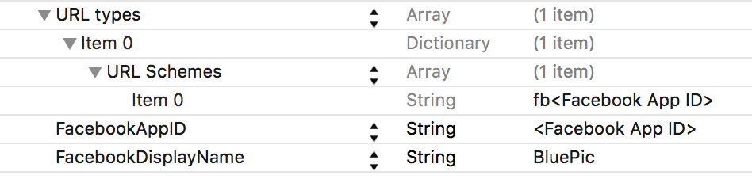
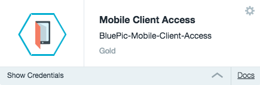
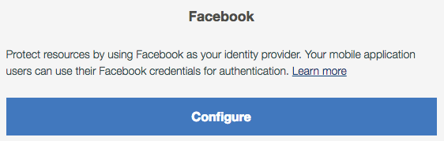
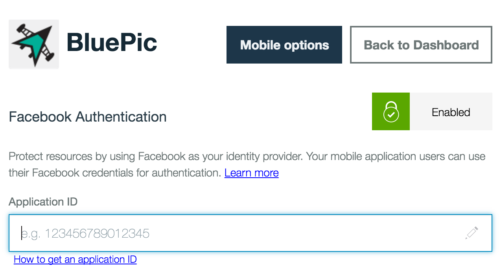
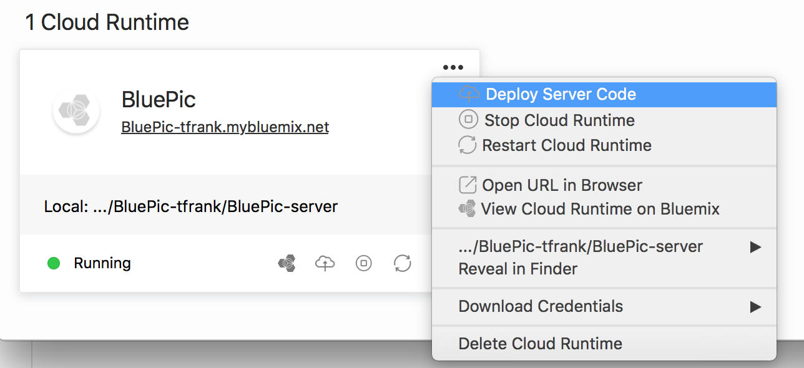

# BluePic

BluePic is a photo and image sharing sample application that allows you to take photos and share them with other BluePic users. This sample application demonstrates how to leverage, in a mobile iOS 9 application, a Kitura-based server application written in Swift.

Bluepic takes advantage of Swift in a typical iOS client setting, but also on the server-side using the new Swift web framework and HTTP Server, Kitura. An interesting feature of Bluepic, is the way it handles photos on the server. When an image is posted, it's data is recorded in Cloudant and the image binary is stored in Object Storage. From there, an [OpenWhisk](http://www.ibm.com/cloud-computing/bluemix/openwhisk/) sequence is invoked causing weather data like temperature and current condition (e.g. sunny, cloudy, etc.) to be calculated based on the location an image was uploaded from. AlchemyAPI is also used in the OpenWhisk sequence to analyze the image and extract text tags based on the content of the image. A push notification is finally sent to the user, informing them their image has been processed and now includes weather and tag data.

## Swift version
The back-end components (i.e. Kitura-based server and OpenWhisk actions) of the BluePic app work with the `DEVELOPMENT-SNAPSHOT-2016-05-03-a` version of the Swift binaries. You can download this version of the Swift binaries by following this [link](https://swift.org/download/). Compatibility with other Swift versions is not guaranteed.

Optionally, if you'd like to run the BluePic Kitura-based server using Xcode, you should use Xcode 7.3.1 and configure it to use the `DEVELOPMENT-SNAPSHOT-2016-05-03-a` toolchain. For details on how to set up Xcode see [Building your Kitura application on XCode](https://github.com/IBM-Swift/Kitura/wiki/Building-your-Kitura-application-on-XCode). Please note that any other versions of Xcode are not guaranteed to work with the back-end code.

The iOS component of the BluePic app uses the default toolchain (Swift 2.2.1) prepackaged with Xcode 7.3.1. At the moment, any other versions of Xcode are not guaranteed to work. You may get unexpected behavior and/or errors if attempting to use other versions of Xcode or Swift.

## Getting started
There are *two ways* you can compile and provision BluePic on Bluemix. Method 1 uses the [IBM Cloud Tools for Swift](https://ibm-cloud-tools.mybluemix.net/) application. Using IBM Cloud Tools for Swift is the easiest and quickest path to get BluePic up and running. Method 2 is manual, does not leverage this tool, and, therefore, takes longer but you get to understand exactly the steps that are happening behind the scenes. Regardless of what what path you choose, there are a few optional steps you can complete for additional functionality.

## Method 1: IBM Cloud Tools for Swift
Once you have the IBM Cloud Tools for Swift application installed for Mac, you can open it to get started. On the screen for creating a new project, you will find the option to create a BluePic Project. Select that option and name your project/runtime. This will kick off a process that automatically does the following:

- Installs curl on your local system (requires Homebrew).
- Clones the Bluepic repo on your Mac.
- Creates your Bluemix runtime (i.e Kitura-based server) and provisions the Bluemix services that BluePic can leverage.
- Populates the Cloudant and Object Storage services with demo data.
- Updates the `cloud_config.json` file with all the service credentials needed by the Kitura-based server.
- Updates the `bluemix.plist` file [in the Xcode project] so that the iOS application connects to the remote Kitura-based server running on Bluemix.

After the IBM Cloud Tools for Swift completes the steps above, you can [run the application](#running-the-ios-app). If desired, you can also configured the Bluemix services that were provisioned in order to enable [optional features](#optional-features-to-configure) in BluePic (such as Facebook authentication and Push notifications).

## Method 2: Manual configuration and deployment
Instead of using IBM Cloud Tools for Swift, which gives you a seamless compilation and provisioning experience, you can follow the steps outlined in this section if you'd like to take a peek under the hood!

### 1. Install system dependencies
The following system level dependencies should be installed on OS X using [Homebrew](http://brew.sh/):

```bash
brew install curl
```

If you are using Linux as your development platform, you can find full details on how to set up your environment for building Kitura-based applications at [Getting started with Kitura](https://github.com/IBM-Swift/Kitura).

### 2. Clone the BluePic Git repository
Execute the following command to clone the Git repository:

```bash
git clone https://github.com/IBM-Swift/BluePic.git
```

If you'd like to, you can spend a few minutes to get familiar with the folder structure of the repo as described in the [About](Docs/About.md) page.

### 3. Create BluePic application on Bluemix
Clicking on the button below deploys the BluePic application to Bluemix. The `manifest.yml` file [included in the repo] is parsed to obtain the name of the application and to determine the Cloud Foundry services that should be instantiated. For further details on the structure of the `manifest.yml` file, see the [Cloud Foundry documentation](https://docs.cloudfoundry.org/devguide/deploy-apps/manifest.html#minimal-manifest).

[](https://bluemix.net/deploy)

Once deployment to Bluemix is completed, you should access the route assigned to your application using the web browser of your choice. You should see the Kitura welcome page!

Note that the [Bluemix buildpack for Swift](https://github.com/IBM-Swift/swift-buildpack) is used for the deployment of BluePic to Bluemix. This buildpack is currently installed in the following Bluemix regions: US South, United Kingdom, and Sydney.

### 4. Populate Cloudant database
To populate your Cloudant database instance with sample data, you need to obtain the following credential values:

- `username` - The username for your Cloudant instance.
- `password` - The password for your Cloudant instance.
- `projectid` - The project ID for your Object Storage instance.

You can obtain the above credentials by accessing your application's page on Bluemix and clicking on the `Show Credentials` twisty found on your Cloudant service and Object Storage service instances. Once you have these credentials, navigate to the `Cloud-Scripts/cloudantNoSQLDB/` directory in the BluePic repo and execute the `populator.sh` script as shown below:

```bash
./populator.sh --username=<cloudant username> --password=<cloudant password> --projectid=<object storage projectid>

```

### 5. Populate Object Storage
To populate your Object Storage instance with sample data, you need to obtain the following credential values:

- `userid` - The username for your Object Storage instance.
- `password` - The password for your Object Storage instance.
- `projectid` - The project ID for your Object Storage instance.

You can obtain the above credentials by accessing your application's page on Bluemix and clicking on the `Show Credentials` twisty found on your Object Storage instance. Once you have these credentials,  navigate to the `./Cloud-Scripts/Object-Storage/` directory in the BluePic repo and execute the `populator.sh` script as shown below:

```bash
./populator.sh --userid=<object storage username> --password=<object storage password> --projectid=<object storage projectid>
```

### 6. Update `BluePic-Server/cloud_config.json` file
You should now update the credentials for each one of the services listed in the `BluePic-Server/cloud_config.json` file. This will allow you to run the Kitura-based server locally for development and testing purposes. You will find placeholders in the `cloud_config.json` file (e.g. `<username>`, `<projectId>`) for each of the credential values that should be provided.

Remember that you can obtain the credentials for each service listed in the `cloud_config.json` file by accessing your application's page on Bluemix and clicking on the `Show Credentials` twisty found on each of the service instances bound to the BluePic app.

You can take a look at the contents of the `cloud_config.json` file by clicking [here](BluePic-Server/cloud_config.json).

### 7. Update configuration for iOS app
Go to the `BluePic-iOS` directory and open the BluePic workspace with Xcode using `open BluePic.xcworkspace`. Let's now update the `bluemix.plist` in the Xcode project (you can find this file in `Configuration` folder of the Xcode project).

1. You should set the `isLocal` value to `YES` if you'd like to use a locally running server; if you set the value to `NO`, then you will be accessing the server instance running on Bluemix.

1. To get the `appRouteRemote` and `bluemixAppGUID` value, you should go to your application's page on Bluemix. There, you will find a `MOBILE OPTIONS` link near the top right. Clicking on it should open up a view that displays your `route` which maps to the `appRouteRemote` key in the plist. Make sure to include the `http://` protocol in your `appRouteRemote` and to exclude a forward slash at the end of the url. You will also see an `App GUID` value which maps to the `bluemixAppGUID` key in the plist.

1. Lastly, we need to get the value for `bluemixAppRegion`, which can be one of three options currently:

		REGION US SOUTH | REGION UK | REGION SYDNEY
		--- | --- | ---
		`.ng.bluemix.net` | `.eu-gb.bluemix.net` | `.au-syd.bluemix.net`

You can find your region in multiple ways. For instance, by just looking at the URL you use to access your application's page (or the Bluemix dashboard). Another way is to look at the `cloud_config.json` file you modified earlier. If you look at the credentials under your `AdvancedMobileAccess` service, there is a value called `serverUrl` which should contain one of the regions mentioned above. Once you insert your `bluemixAppRegion` value into the `bluemix.plist`, your app should be configured.

## Optional features to configure
This section describes the steps to take in order to leverage Facebook authentication with Mobile Client Access, Push Notifications, and OpenWhisk.

### 1. Create an application instance on Facebook
In order to have the app authenticate with Facebook, you must create an application instance on Facebook's website.

1. Go to the `BluePic-iOS` directory and open the BluePic workspace with Xcode using `open BluePic.xcworkspace`.

1. Choose a bundle identifier for your app and update the Xcode project accordingly: Select the project navigator folder icon located in the top left of Xcode; then select the BluePic project at the top of the file structure and then select the BluePic target. Under the identity section, you should see a text field for the bundle identifier. Update this field with a bundle identifier of your choosing. (i.e. com.bluepic)

1. Go to [Facebook's Quick Start for iOS](https://developers.facebook.com/quickstarts/?platform=ios) page to create an application instance. Type `BluePic` as the name of your new Facebook app and click the `Create New Facebook App ID` button. Choose any Category for the application, and click the `Create App ID` button.

1. On the screen that follows, note that you **do not** need to download the Facebook SDK. The Mobile Client Access framework (already included in the iOS project) has all the code needed to support Facebook authentication. In the `Configure your info.plist` section, under `step 2`, copy the fields shown in the XML snippet into the `info.plist` file. The `info.plist` file is found in the `Configuration` folder of the Xcode project. If you have trouble finding the `CFBundleURLType` key, note that Xcode changes the `CFBundleURLType` key to `URL types` when the key is entered. Your `info.plist` file should now look like this:
<p align="center"></p>

1. Next, scroll to the bottom of the quick start page where it says `Supply us with your Bundle Identifier` and enter the app's bundle identifier you chose earlier.

1. That's it for setting up the BluePic application instance on the Facebook Developer website. In the following section, we will link this Facebook application instance to your Bluemix Mobile Client Access service.

### 2. Configure Bluemix Mobile Client Access
1. Go to your application's page on Bluemix and open your `Mobile Client Access` service instance:
<p align="center"></p>

1. On the page that follows, click the `configure` button under the Facebook section.
<p align="center"></p>

1. On the next page, enter your Facebook application ID (see [Create an application instance on Facebook](#1-create-an-application-instance-on-facebook) section for further details). Click on the Save button.
<p align="center"></p>

1. Facebook authentication with Bluemix Mobile Client Access is now completely set up!

### 3. Configure Bluemix Push service
To utilize push notification capabilities on Bluemix, you need to configure a notification provider. For BluePic, you should configure credentials for the Apple Push Notification Service (APNS). As part of this configuration step, you will need to use the **bundle identifier** you chose in the [Create an application instance on Facebook](#1-create-an-application-instance-on-facebook) section.

Luckily, Bluemix has [instructions](https://console.ng.bluemix.net/docs/services/mobilepush/t_push_provider_ios.html) to walk you through that process. Please note that you'd need to upload a `.p12` certificate to Bluemix and enter the password for it, as described in the Bluemix instructions.

Lastly, remember that push notifications will only show up on a physical iOS device.

### 4. Configure OpenWhisk
BluePic leverages OpenWhisk actions written in Swift for accessing the Alchemy Vision and Weather APIs. For instructions on how to configure OpenWhisk, see the following [page](Docs/OpenWhisk.md). You will find there details on configuration and invocation of OpenWhisk commands.

### 5. Redeploy BluePic app to Bluemix
#### Using the IBM Cloud Tools for Swift
After configuring the optional features, you should redeploy the BluePic app to Bluemix. If you used the IBM Cloud Tools for Swift to initially deploy the BluePic app to Bluemix, you can also use this tool to redeploy the app. On your project's page in the IBM Cloud Tools for Swift, you should find an entry for the BluePic app runtime. On that entry, you will find options for deploying the runtime to Bluemix, as shown here:

<p align="center"></p>

#### Using the Cloud Foundry command line
After configuring the optional features, you should redeploy the BluePic app to Bluemix. You can use the Cloud Foundry [command line](https://docs.cloudfoundry.org/devguide/cf-cli/install-go-cli.html) to do so. Once you have logged in to Bluemix using the command line, you can execute `cf push` from the root folder of this repo on your local file system. This will push the application code and configuration to Bluemix.

## Running the iOS app
If you don't have the iOS project already open, go to the `BluePic-iOS` directory and open the BluePic workspace using `open BluePic.xcworkspace`.

You can now build and run the iOS app using the Xcode capabilities you are used to!

## Running the Kitura-based server locally
You can build the BluePic-Server by going to the `BluePic-Server` directory of the cloned repository and running `make`. To start the Kitura-based server for the BluePic app on your local system, go to the `BluePic-Server` directory of the cloned repository and run `.build/debug/Server`. You should also update the `bluemix.plist` file in the Xcode project in order to have the iOS app connect to this local server. See the [Update configuration for iOS app](#7-update-configuration-for-ios-app) section for details.

## Using BluePic
BluePic was designed with a lot of useful features. To see further information and details on how to use the iOS app, check out our walkthrough on [Using BluePic](Docs/Usage.md) page.

## About BluePic
To learn more about BluePic's folder structure, its architecture, and the Swift packages it depends on, see the [About](Docs/About.md) page.

## Reporting issues against
You can use the [dW Answers](https://developer.ibm.com/answers/topics/cloud-tools-for-swift.html) web site to ask a question and/or report any issues you encounter while using the IBM Cloud Tools for Swift. Just make sure you use the tag `cloud-tools-for-swift` for the questions you post on dW Answers.

## License
This application is licensed under Apache 2.0. Full license text is available in [LICENSE](LICENSE).

For a list of demo images used, view the [Image Sources](Docs/ImageSources.md) file.
