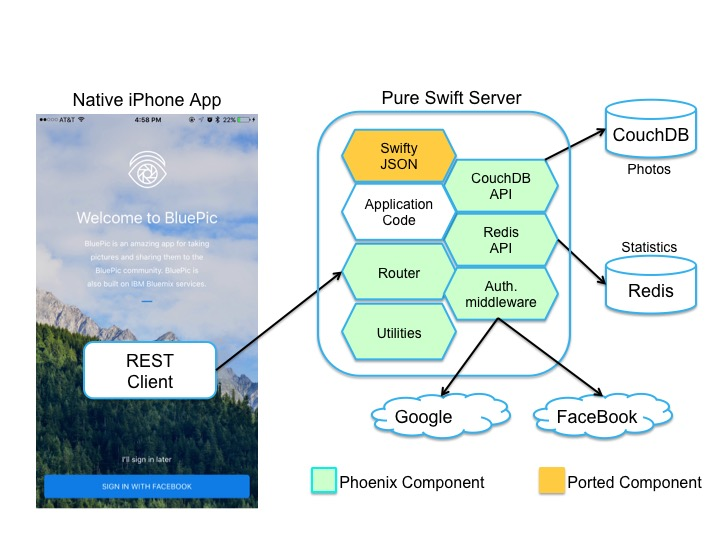

<br>
#SwiftBluePic

SwiftBluePic is a sample application for iOS that shows you how to connect your mobile application with Phoenix server written in Swift. SwiftBluePic is based on [BluePic](./Original-README.md) app. It is a photo sharing app that allows you to take photos, upload them and share them with the BluePic community.

<br>
## Table of Contents
* [Requirements](#requirements)
* [Getting Started](#getting-started)
* [Using BluePic](#using-bluepic)
* [Project Structure](#project-structure)
* [Architecture](#architecture/bluemix-services-implementation)
* [License](#license)

<br>
## Requirements
[Phoenix](https://github.ibm.com/ibmswift/Phoenix), [CouchDB](http://couchdb.apache.org/)

<br>
## Getting Started

### 1. Install CouchDB
Follow [these instructions](https://wiki.apache.org/couchdb/Installation).

<br>
### 2. Configure and run BluePic-server
1. Change `BluePic-server/config.json` to your CouchDB location:
```json
{
  "couchDbIpAddress": "<CouchDB IP Address>",
  "couchDbPort": 5984,
  "couchDbDbName": "swift-bluepic"
}
```
1. In `BluePic-server` directory run
```
swift build
.build/debug/BluePic-server
```

1. For now, until we don't have a web based admin UI, you will need to run
```
 curl -X POST http://localhost:8090/admin/setup
 ```

<br>

## Using BluePic

### Facebook Login
BluePic was designed so that anyone can quickly launch the app and view photos posted without needing to log in. However, to view the profile or post photos, the user can easily login with his/her Facebook account. This is only used for a unique user id, the user's full name, as well as to display the user's profile photo.

<p align="center">
</p>
<p align="center">Figure 1. Welcome page.</p>

<br>
At the moment only "dummy" login is implemented.

### View Feed
The feed (first tab) shows all the latest photos posted to the BluePic community (regardless if logged in or not).

<p align="center">
</p>
<p align="center">Figure 2. Main feed view.</p>

### Post a Photo
Posting to the BluePic community is easy. Tap the middle tab in the tab bar and choose to either Choose a photo from the Camera Roll or Take a photo using the device's camera. You can then give the photo a caption before posting.

<p align="center">
</p>
<p align="center">Figure 3. Posting a photo.</p>

### View Profile
By tapping the third tab, you can view your profile. This shows your Facebook profile photo, lists how many photos you've posted, and shows all the photos you've posted to BluePic.

<p align="center">
</p>
<p align="center">Figure 4. Profile feed.</p>

<br>
## Project Structure
* `/BluePic-iOS` directory for the iOS client.
* `/BluePic-server` directory for the BluePic-server.
* `/img` directory for images for this README.

<br>
## Architecture

<p align="center">
</p>
<p align="center">Figure 5. Swift-BluePic Architecture Diagram.</p>


<br>
## License
This library is licensed under Apache 2.0. Full license text is
available in [LICENSE](LICENSE).
