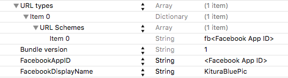
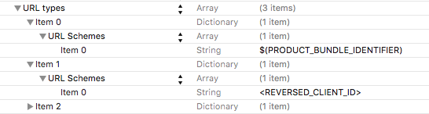

#BluePic

**This repo is not ready for comsumption yet. This is a new development effort that has just started. If you are looking for the Kitura-BluePic repo, please visit this URL: https://github.com/IBM-Swift/Kitura-BluePic.**


Kitura BluePic is a sample application for iOS that shows you how to connect your mobile application with Kitura server written in Swift. It is a photo sharing app that allows you to take photos, upload them and share them with the Kitura BluePic community.

## Table of Contents

* [Requirements](#requirements)
* [Getting Started](#getting-started)
* [Using Kitura BluePic](#using-kitura-bluepic)
* [Project Structure](#project-structure)
* [Architecture](#architecture)
* [License](#license)

## Requirements

- XCode 7.3
- [Kitura](https://github.com/IBM-Swift/Kitura-BluePic)
- [Kitura CouchDB](https://github.com/IBM-Swift/Kitura-CouchDB)
- [Kitura Redis](https://github.com/IBM-Swift/Kitura-redis)

## Getting Started

#### 1. Install CouchDB and Redis
[CouchDB installation instructions](https://wiki.apache.org/couchdb/Installation).

[Redis installation instructions](http://redis.io/download).

#### 2. Clone the Kitura-Bluepic Git repository

```bash
cd <some directory>
git clone https://github.com/IBM-Swift/Kitura-BluePic
```

#### 3. Configure the KituraBluePic-server

Update in the `KituraBluePic-server/config.json` file in your cloned repository:

1. The CouchDB server's IP address and port
2. The name of the CouchDB database you want to use

As in the following example:

```json
{
  "couchDbIpAddress": "<CouchDB server IP Address>",
  "couchDbPort": 5984,
  "couchDbDbName": "swift-bluepic",
  "redisIpAddress": "<Redis server IP Address>",
  "redisPort": 6379
}
```

#### 4. Build the KituraBluePic-server

To build the KituraBluePic-server, you need to have your environment set up to build Kitura applications.

[Getting started with Kitura](https://github.com/IBM-Swift/Kitura)

In `KituraBluePic-server` directory of the cloned repository run

```bash
make
```

#### 5. Run the KituraBluePic-server

In `KituraBluePic-server` directory of the cloned repository run

```bash
.build/debug/KituraBluePic-server
```

#### 6. Setup the CouchDB database
For now, until we have a web based admin UI, you will need to run
```bash
 curl -X POST http://localhost:8090/admin/setup
```

#### 7. Installing needed CocoaPods

1. If needed install CocoaPods by running:
```bash
sudo gem install cocoapods
```

2. Go to the KituraBluePic-iOS directory and run:
```bash
pod install
```

**Note:** When opening the KituraBluePic project in XCode, always open the Workspace (KituraBluePic.xcworkspace) as with any project that uses CocoaPods.

#### 8. Create an application instance on Facebook or Google

##### Facebook
In order to have the app authenticate with Facebook, you must create an application instance on Facebook's website.

1. To create an application instance on Facebook's website, first go to [Facebook's Quick Start for iOS](https://developers.facebook.com/quickstarts/?platform=ios) page. Type 	`KituraBluePic` as the name of your new Facebook app and click the `Create New Facebook App ID` button.

1. On the screen that follows, in the `Configure your info.plist` section under `step 2`, copy the information into your `info.plist` file. You can find the `info.plist` file in `Configuration` folder of the Xcode project. If you have trouble finding the `CFBundleURLType` key, note that Xcode changes the `CFBundleURLType` key to `URL types` when the key is entered. Your `info.plist` file should now look like this:
<p align="center">
</p>
<p align="center">Figure 4. Info.plist file.</p>

1. Next scroll to the bottom of the quick start page where it says `Supply us with your Bundle Identifier` and enter the app's bundle identifier. To find the bundle identifier in the Xcode project you can do the following:
    * Make sure the project navigator folder icon is selected in the top left of Xcode. Select the KituraBluePic project at the top of the file structure and then select the KituraBluePic target. Under the identity section, you should see a text field for the bundle identifier that is empty. You can make the bundle identifier anything you want, `com.KituraBluePic` for example.
1. Once you entered the bundle ID on the Facebook quick start page, click `next`. That's it for the Facebook quick start setup.


##### Google

1. Go to [Enable Google services for your app](https://developers.google.com/mobile/add?platform=ios) page, and create  a new project: type `KituraBluePic` as the name of your new app, and enter the app's bundle id. To find the bundle identifier in the Xcode project you can do the following:
	* Make sure the project navigator folder icon is selected in the top left of Xcode. Select the KituraBluePic project at the top of the file structure and then select the KituraBluePic target. Under the identity section, you should see a text field for the bundle identifier that is empty. You can make the bundle identifier anything you want, `com.KituraBluePic` for example.) and click the `Create` button.

1. Now press the `Continue and configure services` button.

1. On the screen that follows, choose Google Sign-In service and press the `Enable Google Sign-In` button.

1. Press the `Generate configuration files` button. On the next screen press `Download GoogleService-Info.plist`. Drag the downloaded GoogleService-Info.plist file into the `Configuration` directory of Kitura-BluePic project.

1. Open `Configuration/Info.plist` in Xcode. Under URL Types create a new item and paste your REVERSED_CLIENT_ID into the URL Schemes field (you can find your REVERSED_CLIENT_ID in the `GoogleService-Info.plist` file). Create another new item and type your bundle identifier in the URL Schemes field. Your `Info.plist` file should now look like this:
<p align="center">
</p>
<p align="center">Figure 4. Info.plist file.</p>


## Using Kitura BluePic

### Facebook and Google Login

Kitura BluePic was designed so that anyone can quickly launch the app and view photos posted without needing to log in. However, to view the profile or post photos, the user can easily login with his/her Facebook  or Google account. This is only used for a unique user id, the user's full name, as well as to display the user's profile photo.

<p align="center">
</p>
<p align="center">Figure 1. Welcome page.</p>

<br>

### View Feed

The feed (first tab) shows all the latest photos posted to the Kitura BluePic community (regardless if logged in or not).

<p align="center">
</p>
<p align="center">Figure 2. Main feed view.</p>

### Post a Photo

Posting to the Kitura BluePic community is easy. Tap the middle tab in the tab bar and choose to either Choose a photo from the Camera Roll or Take a photo using the device's camera. You can then give the photo a caption before posting.

<p align="center">
</p>
<p align="center">Figure 3. Posting a photo.</p>

### View Profile

By tapping the third tab, you can view your profile. This shows your Facebook or Google profile photo, lists how many photos you've posted, and shows all the photos you've posted to Kitura BluePic.

<p align="center">
</p>
<p align="center">Figure 4. Profile feed.</p>


## Project Structure

* `/KituraBluePic-iOS` directory for the iOS client.
* `/KituraBluePic-server` directory for the KituraBluePic-server.
* `/img` directory for images for this README.


## Architecture

<p align="center">
</p>
<p align="center">Figure 5. Kitura BluePic Architecture Diagram.</p>


## License

This library is licensed under Apache 2.0. Full license text is available in [LICENSE](LICENSE).
