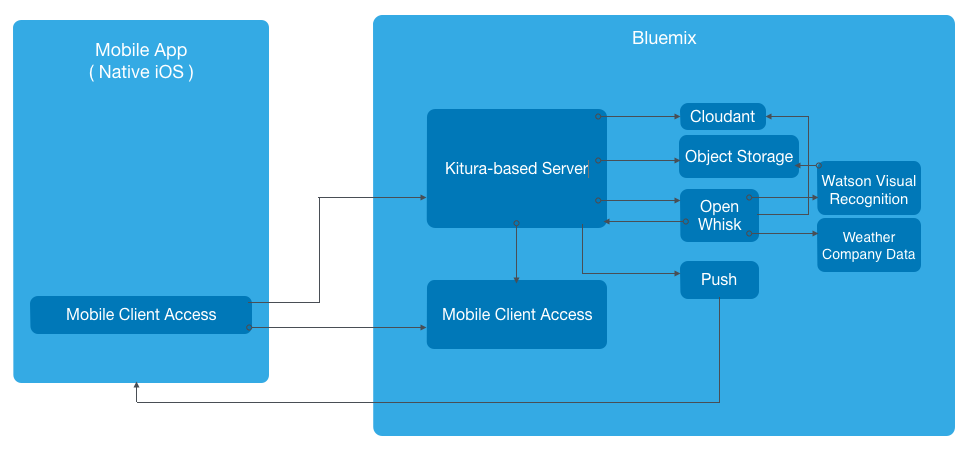

#BluePic

**This repo is not ready for consumption yet and please note that this README is still under construction This is a new development effort that has not completed yet. If you are looking for the Kitura-BluePic repo, please visit this URL: https://github.com/IBM-Swift/Kitura-BluePic.**

BluePic is a photo and image sharing sample application that allows you to take photos and share them with other BluePic users. This sample application demonstrates how to leverage a Kitura-based server application [written in Swift] in a mobile iOS 9 application.

## Table of Contents

* [Project Structure](#project-folder-structure)
* [Swift Packages](#swift-packages)
* [Getting Started](#getting-started)
* [Using BluePic](#using-bluepic)
* [Architecture](#architecture)
* [License](#license)

## Project folder Structure

* `./BluePic-iOS` - Contains the iOS client application.
* `./BluePic-Server` - Contains the Kitura-based server application and its dependencies. This folder contains the artifacts that are deployed to Bluemix.
* `./BluePic-OpenWhisk` - Contains the OpenWhisk actions and sequence code written in Swift.
* `./Docs` - Contains additional project documentation.
* `./Imgs` - Contains images referenced in this `README` file.

## Swift Packages

The following Swift packages are used in BluePic:

- [Kitura-CouchDB](https://github.com/IBM-Swift/Kitura-CouchDB)
- [Kitura](https://github.com/IBM-Swift/Kitura.git)
- [Swift-cfenv](https://github.com/IBM-Swift/Swift-cfenv.git)
- [Swift SDK for Bluemix Object Storage Service](https://github.com/ibm-bluemix-mobile-services/bluemix-objectstorage-swift-sdk.git)
- [Kitura Credentials plugin for the Mobile Client Access service](https://github.com/ibm-bluemix-mobile-services/bms-mca-kitura-credentials-plugin.git)
- [Swift SDK for Bluemix Push Notifications Service](https://github.com/ibm-bluemix-mobile-services/bms-pushnotifications-serversdk-swift.git)

## Getting Started

#### 1. Install system dependencies

The following system level dependencies should be installed on OS X using [Homebrew](http://brew.sh/):

```bash
brew install curl
```

If you are using Linux as your development platform, you can find full details on how to set up your environment for building Kitura-based applications at [Getting started with Kitura](https://github.com/IBM-Swift/Kitura).

#### 2. Clone the BluePic Git repository

```bash
git clone https://github.com/IBM-Swift/BluePic.git
```

#### 3. Create an application instance on Facebook

In order to have the iOS application authenticate with Facebook, you must create an application instance on Facebook's website.

1. Go to [Facebook's Quick Start for iOS](https://developers.facebook.com/quickstarts/?platform=ios) page. Type `BluePic` as the name of your new Facebook app and click the `Create New Facebook App ID` button.

1. On the screen that follows, you **do not** need to download the Facebook SDK, the necessary components are included in the MCA framework. Next, in the `Configure your info.plist` section under `step 2`, copy the information into your `info.plist` file. You can find the `info.plist` file in `Configuration` folder of the Xcode project. Among other values, your `info.plist` file should contain the following:
<p align="center"></p>

1. Next scroll to the bottom of the quick start page where it says `Supply us with your Bundle Identifier` and enter the app's bundle identifier. To find the bundle identifier in the Xcode project you can do the following:
    * Make sure the project navigator folder icon is selected in the top left of Xcode. Select the BluePic project at the top of the file structure and then select the BluePic target. Under the identity section, you should see a text field for the bundle identifier that is empty. You can make the bundle identifier anything you want, `com.BluePic` for example.

1. Once you entered the bundle ID on the Facebook quick start page, click `next`.

#### 4. Create BluePic application on Bluemix

You can click the magical button below to automatically deploy the BluePic application to Bluemix:

[](https://bluemix.net/deploy)

When automatically deploying to Bluemix, the `manifest.yml` file [included in the repo] is parsed to obtain the name of the application and to determine the Cloud Foundry services that should be instantiated. For further details on the structure of the `manifest.yml` file, see the [Cloud Foundry documentation](https://docs.cloudfoundry.org/devguide/deploy-apps/manifest.html#minimal-manifest).

Note that the [Bluemix buildpack for Swift](https://github.com/IBM-Swift/swift-buildpack) is used for the deployment of BluePic to Bluemix.

#### 5. Configure Bluemix MCA

TODO: ADD CONTENTS

#### 6. Configure Bluemix Push service

It is important to note that we will need to configure a notification provider before we can really use the Bluemix Push service. In our case, we need to configure credentials for the Apple Push Notification Service (APNS). Luckily, Bluemix has instructions to walk you though that process, you can find that [here](https://console.ng.bluemix.net/docs/services/mobilepush/t_push_provider_ios.html).

Do not forget to upload the .p12 certificate to Bluemix as well as enter the password for that certificate, as mentioned in instructions, linked to above.
Once you have completed the appropriate steps with Apple and Bluemix, just make sure the `bluemix.plist` was correctly updated in step 4.

Lastly, remember that push notifications will only show up on a physical iOS device.

#### 7. Configure OpenWhisk

TODO: ADD CONTENTS

#### 8. Populate Cloudant database

Execute the following shell script:

```bash
./BluePic-Server/resources/cloudant/populate_db.sh --username=<cloudant username> --password=<cloudant password> --projectid=<object storage projectid>

```

#### 9. Populate Object Storage

Execute the following shell script:

```bash
./BluePic-Server/resources/cloudant/populate_containers.sh --userid=<object storage username> --password=<object storage password> --projectid=<object storage projectid>
```

#### 10. Update `BluePic-Server/config.json` file

After deploying BluePic to Bluemix and configuring its services, you also have the option to run the Kitura-based server locally for development and testing purposes. To run the Kitura-based server locally, you'd need to update the credentials for each one of the services listed in the ```BluePic-Server/config.json``` file:

```json
...
"services": {
  "AdvancedMobileAccess": [
    {
      "name": "Mobile Client Access-ag",
      "label": "AdvancedMobileAccess",
      "plan": "Gold",
      "credentials": {
        "serverUrl": "<serverUrl>",
        "clientId": "<clientId>",
        "secret": "<secret>",
        "tenantId": "<tenantId>",
        "admin_url": "<admin_url>"
      }
    }
  ],
  "imfpush": [
    {
      "name": "IBM Push Notifications-12",
      "label": "imfpush",
      "plan": "Basic",
      "credentials": {
        "url": "<url>",
        "admin_url": "<admin_url>",
        "appSecret": "<appSecret>"
      }
    }
  ],
  "cloudantNoSQLDB": [
    {
      "name": "Cloudant NoSQL DB-fz",
      "label": "cloudantNoSQLDB",
      "plan": "Shared",
      "credentials": {
        "username": "<username>",
        "password": "<password>",
        "host": "<host>",
        "port": 443,
        "url": "<url>"
      }
    }
  ],
  "Object-Storage": [
    {
      "name": "Object Storage-bv",
      "label": "Object-Storage",
      "plan": "standard",
      "credentials": {
        "auth_url": "https://identity.open.softlayer.com",
        "project": "<project>",
        "projectId": "<projectId>",
        "region": "<region>",
        "userId": "<userId>",
        "username": "<username>",
        "password": "<password>",
        "domainId": "<domainId>",
        "domainName": "<domainName>"
      }
    }
  ]
}
...
```

#### 11. Build the BluePic-Server

To build the BluePic-Server, go to the `BluePic-Server` directory of the cloned repository and run:

```bash
make
```

#### 12. Run the BluePic-Server

From the `BluePic-Server` directory of the cloned repository, run:

```bash
.build/debug/Server
```

#### 13. Run the iOS app

Go to the BluePic-iOS directory and open the BluePic workspace using Xcode:

```bash
open BluePic.xcworkspace
```

#### 13.1 Simulate Location on Simulator
If you try to post a photo within the iOS simulator and the app doesn't know your location, it won't work. To fix this simulator specific issue, simply set a location in the simulator's debug menu:

<p align="center">
</p>
<p align="center">Figure 1. Set simulated location</p>

Any location should work fine, but remember this may have to be done on each initial launch of a certain simulator, if you want to be able to post images. Running Bluepic on a physical device avoids this issue entirely.

## Using BluePic

BluePic was designed with a lot of useful features, so to view them all, check out our walkthrough on [Using Bluepic](Docs/Using-Bluepic.md)

## Architecture

<p align="center">
</p>
<p align="center">Figure 2. BluePic Architecture Diagram.</p>

## License

This application is licensed under Apache 2.0. Full license text is available in [LICENSE](LICENSE).
