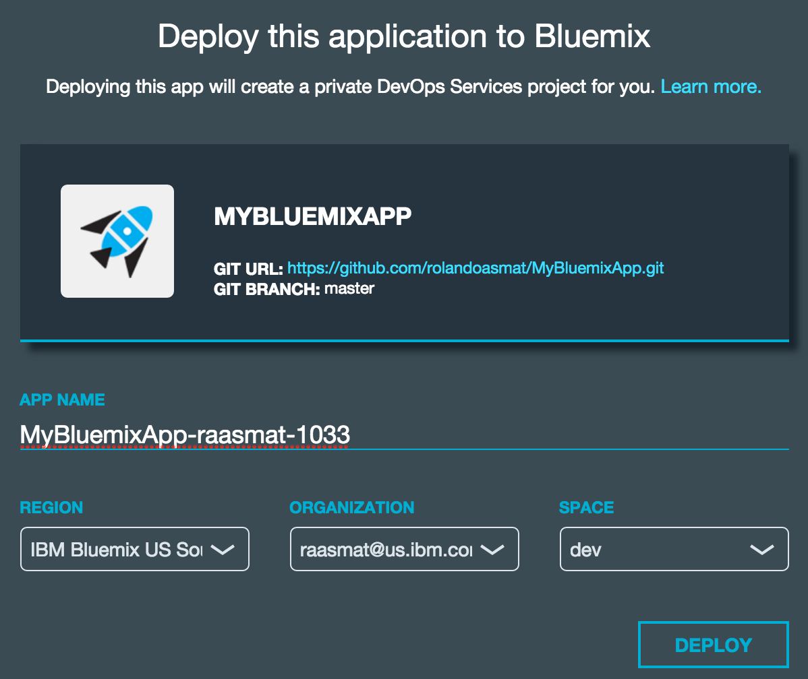
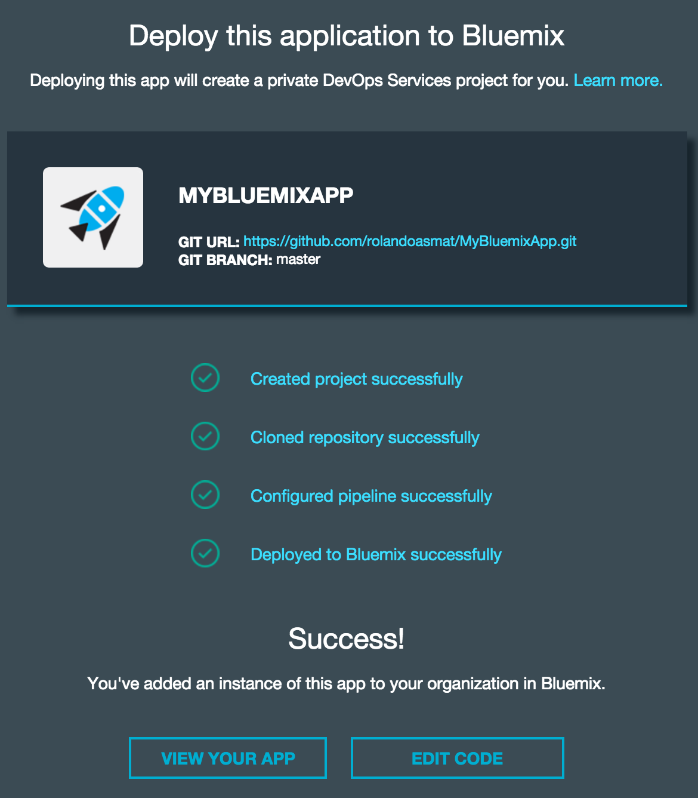
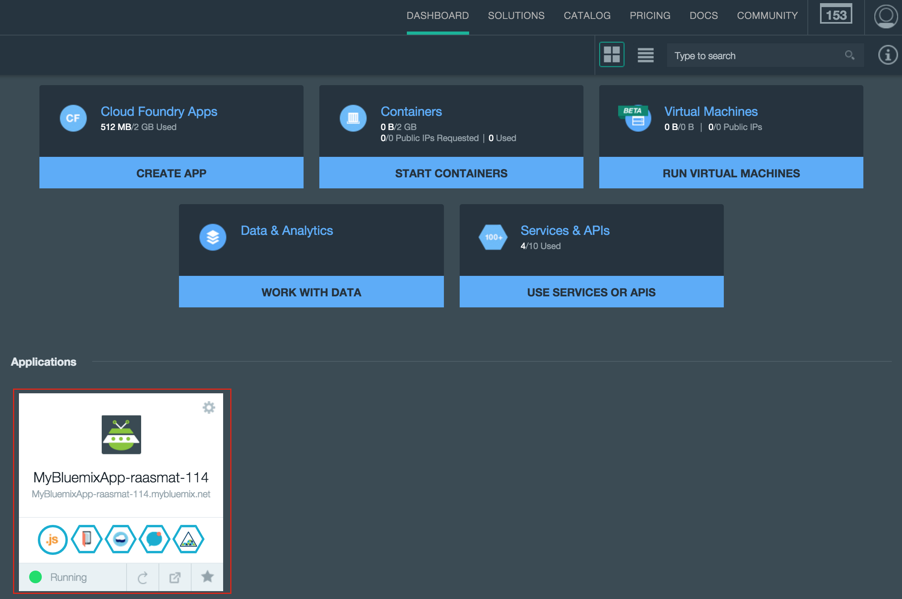

# BluePic

BluePic is a sample application for iOS that shows you how to connect your mobile application with IBM Bluemix services. It is a photo sharing app that allows you to take photos, upload them and share them with the BluePic community.

<br>
## Table of Contents
* [About IBM Bluemix](#about-ibm-bluemix)
* [Requirements](#requirements)
* [Getting Started](#getting-started)
* [Using BluePic](#using-bluepic)
* [Project Structure](#project-structure)
* [Architecture/Bluemix Services Implementation](#architecture/bluemix-services-implementation)
* [Architecture Forethought](#architecture-forethought)
* [License](#license)

<br>
## About IBM Bluemix

[Bluemix™](https://developer.ibm.com/sso/bmregistration?lang=en_US&ca=dw-_-bluemix-_-cl-bluemixfoundry-_-article) is the latest cloud offering from IBM®. It enables organizations and developers to quickly and easily create, deploy, and manage applications on the cloud. Bluemix is an implementation of IBM's Open Cloud Architecture based on [Cloud Foundry](https://www.cloudfoundry.org/), an open source Platform as a Service (PaaS). Bluemix delivers enterprise-level services that can easily integrate with your cloud applications without you needing to know how to install or configure them.

In Bluemix you should be aware that often the term “Application” is used to refer to a server component and its Bluemix services needed. It is this server component that gets deployed to Bluemix. It is not the mobile application that gets deployed, this will become clear as you go through the Getting Started guide. 

<br>
## Requirements
Currently, BluePic supports Xcode 7.1.1, iOS 9+, and Swift 2. Designed for iPhone, compatible with iPad.

<br>
## Getting Started

### 1. Create Bluemix Application and Services
Click the Deploy to Bluemix button below. It will create a Bluemix application in your account (it will prompt you to create one if you don't have one) and initialize the required services.
<p align="center">
<a href="https://bluemix.net/deploy?repository=https://github.com/rolandoasmat/MyBluemixApp.git"> </a>
</p>

If desired, update the app name, region, organization or space of the application (default parameters work). Click DEPLOY.
<p align="center">
</p>
<p align="center">Figure 1: Parameters to deploy a Bluemix application.</p>

Upon success you should see:
<p align="center">
</p>
<p align="center">Figure 2: Deploy success page.</p>

Note: If deploying to Bluemix fails, make sure to manually delete the failed application on the Bluemix Dashboard as well as the created project on DevOps services (formerly known as JazzHub) before trying again.


Next go to your dashboard by clicking the dashboard link on the top of the page. On your dashboard the application should then become accessible:
<p align="center">
</p>
<p align="center">Figure 3: Bluemix dashboard.</p>

<br>
### 2. Create an application instance on Facebook
In order to have the app authenticate with Facebook, you must create an application instance on Facebook's website and connect it to your Bluemix app's Mobile Client Access.

1. To create an application instance on Facebook's website, first go to [Facebook's Quick Start for iOS](https://developers.facebook.com/quickstarts/?platform=ios) page. Type 	`BluePic` as the name of your new Facebook app and click the `Create New Facebook App ID` button.

1. On the screen that follows, in the `Configure your info.plist` section under `step 2`, copy that information into your `info.plist` file. You can find the `info.plist` file in Configuration folder of the xcode project. If you have trouble finding the `CFBundleURLType` key, note that xcode changes the `CFBundleURLType` key to `URL types` when the key is entered. Your `info.plist` file should now look like this:
<p align="center">
</p>
<p align="center">Figure 4. Info.plist file.</p>

1. Next scroll to the bottom of the quick start page where it says `Supply us with your Bundle Identifier` and enter the app's bundle identifier. To find the bundle identifer in the Xcode project you can do the following: 
	* Make sure the project navigator folder icon is selected in the top left of xcode. Select the BluePic project at the top of the file structure and then select the BluePic target. Under the identity section, you should see a text field for the bundle identifier that is empty. You can make the bundle identifier anything you want, `com.BluePic` for example.
1. Once you you entered the bundle ID on the Facebook quick start page, click `next`. Thats it for the Facebook quick start setup!
1. Next go back to your Bluemix dashboard, under services click `BluePic-AdvancedMobileAccess`. On the page that shows click the `Set Up Authentication` button and then click `Facebook`. Enter your Facebook app ID you gathered from step 2 and press next. 

Thats it for all the Facebook login setup. The rest of the Facebook authentication steps are already setup in the BluePic Xcode project!


### 3. Connect BluePic to your Bluemix Account
The app has to be configured with certain credentials from each of the three Bluemix services. The file `keys.plist` located in the `Configuration` directory of the BluePic Xcode project must be updated with the following credentials:

<p align="center">
</p>
<p align="center">Figure 5. keys.plist located in the BluePic-iOS/BluePic/Configuration directory.</p>

To Begin, click on your BluePic application in the Application section of your Bluemix Dashboard. You should then see the following screen:

<p align="center">
</p>
<p align="center">Figure 6. Application overview page, marked with credentials location.</p>

#### Cloudant NoSQL DB (marked 1 above)

* cdt_username: "username" from corresponding credentials section, see Figure 6.
* cdt_db\_name: Create a dabatase from the Cloudant Dashboard and put the name of created database here.  
* cdt_key: Generate an API KEY from the Cloudant Dashboard by clicking "Generate API Key" in the permissions tab of any database. Make sure to add Writer and Replicator permissions as well. Note the displayed password.
* cdt_pass: Enter the password of the API Key here.
* cdt_tests\_db\_name: Create a dabatase for the test cases to run in, put that name here. Once created go to "Permissions" tab, under "Share Database" put the API KEY from above, again ensure it has Writer and Replicator permissions.

#### Mobile Client Access (marked 2 above)

* backend_route: List on the top of the Application Overview page, next to the "Routes:" label, see Figure 6. 
* GUID: "clientId" from corresponding credentials section, see Figure 6.

#### Object Storage (marked 3 above)

Download and install the [Cloud Foundry CLI](https://github.com/cloudfoundry/cli/releases) and run the following command

`cf service-key 'Object Storage-rz' object-storage-bluepic-key`

It will return several keys.

* obj_stg\_public\_url: "auth\_url" from CF CLI command. 
* obj_stg\_password: "password" from CF CLI command.
* obj_stg\_user\_id: "userId" from CF CLI command.
* obj_stg\_project\_id: "projectId" from corresponding credentials section, see Figure 6.
* obj_stg\_auth\_url: "auth\_url" from corresponding credentials section, see Figure 6.

<br>
### 4. Pre-populate Feed with Stock Photos (Optional)
Once BluePic is configured, you should be able to upload photos and see them appear on the feed and profile. However, initially your feed will be empty. If you would like to pre-populate your feed with 3 images, simply do the following:

1. With the BluePic Xcode project open, show the Test Navigator by clicking the 4th icon from the right of the Navigator (toolbar frame on the left side)
<p align="center">
</p>
<p align="center">Figure 7. PopulateFeedWithPhotos test case.</p>

1. Run the test called PopulateFeedWithPhotos which should be grayed out (disabled by default when tests are run) by right clicking it and clicking **Test "PopulateFeedWithPhotos"**.

1. The test should complete successfully. Launch BluePic again, and you should see 3 images added by user "Mobile Innovation Lab" on the feed.

<br>
## Using BluePic

### Facebook Login
BluePic was designed so that anyone can quickly launch the app and view photos posted without needing to log in. However, to view the profile or post photos, the user can easily login with his/her Facebook account. This is only used for a unique user id, the user's full name, as well as to display the user's profile photo.

<p align="center">
</p>
<p align="center">Figure 8. Welcome page.</p>

### View Feed
The feed (first tab) shows all the latest photos posted to the BluePic community (regardless if logged in or not).

<p align="center">
</p>
<p align="center">Figure 9. Main feed view.</p>

### Post a Photo
Posting to the BluePic community is easy. Tap the middle tab in the tab bar and choose to either Choose a photo from the Camera Roll or Take a photo using the device's camera. You can then give the photo a caption before posting.

<p align="center">
</p>
<p align="center">Figure 10. Posting a photo.</p>

### View Profile
By tapping the third tab, you can view your profile. This shows your Facebook profile photo, lists how many photos you've posted, and shows all the photos you've posted to BluePic.

<p align="center">
</p>
<p align="center">Figure 11. Profile feed.</p>

<br>
## Project Structure
* `/BluePic-iOS` directory for the iOS client.
* `/BluePic-iOS/BluePic/Configuration` directory for configuring Bluemix services keys.
* `/NodeStarterCode` directory for the server artifact that is deployed to Bluemix.
* `/img` directory for images for this README.

<br>
## Architecture/Bluemix Services Implementation
The following architecture is utilized for BluePic. For authentication, Mobile Client Access with Facebook Authentication is implemented. For profile and photo metadata, the Cloudant SDK is integrated. Finally, for photo storage and hosting, Object Storage is utilized.

<p align="center">
</p>
<p align="center">Figure 12. BluePic Architecture Diagram.</p>

### 1. Mobile Client Access Facebook Authentication
[Bluemix Mobile Client Access Facebook Authentication](https://www.ng.bluemix.net/docs/services/mobileaccess/gettingstarted/ios/index.html) is used for logging into BluePic. 

The `FacebookDataManager` under the `BluePic-iOS/BluePic/DataManagers` directory handles most of the code responsible for Facebook authentication. To start using Bluemix Facebook Authentication, it must first be configured on app launch, and we do this in the `didFinishLaunchingWithOptions()` method of `AppDelegate.swift` by calling the method below.

```swift
func initializeBackendForFacebookAuth() {
    //Initialize backend
    let key = Utils.getKeyFromPlist("keys", key: "backend_route")
    let guid = Utils.getKeyFromPlist("keys", key: "GUID")
    IMFClient.sharedInstance().initializeWithBackendRoute(key, backendGUID: guid);
    
    //Initialize FB
    IMFFacebookAuthenticationHandler.sharedInstance().registerWithDefaultDelegate()
    
    }
```

Also in the App Delegate, two other methods must be overridden to activate Facebook Authentication, as shown below:

```swift
func applicationDidBecomeActive(application: UIApplication) {
    FBAppEvents.activateApp()
    }
      
func application(application: UIApplication, openURL url: NSURL, sourceApplication: String?,annotation: AnyObject) -> Bool {
        return FBAppCall.handleOpenURL(url, sourceApplication:sourceApplication)
    }
```

Now that the Facebook and Bluemix frameworks are configured, you can actually try authenticating to receive a unique identifier for a user. The `FacebookDataManager` deals with authenticating and keeping track of user's credentials in a SharedInstance (singleton). The method below starts the process of showing a native Facebook login to the user when he/she presses the **SIGN IN WITH FACEBOOK** button on the `LoginViewController`.

```swift
/**
     Method to auth user using Facebook SDK
     
     - parameter callback: Success or Failure
     */
    func authenticateUser(callback : ((networkRequest : NetworkRequest) -> ())){
        if (self.checkIMFClient() && self.checkAuthenticationConfig()) {
            self.getAuthToken(callback) //this will in turn present FB login
        }
        else{
            callback(networkRequest: NetworkRequest.Failure)
        }
        
    }
```
The `self.checkAuthenticationConfig()` method call in the code above will try to present the native iOS 9 Safari Facebook Login Modal. The code above either continues with requesting a Facebook token if the login credentials were correct from the user, or throws an error if not correct or the user cancels.

After the user finishes inputting their credentials, the unique user id is received and saved in the `getAuthToken()` method of the `FacebookDataManager`. There, an IMFAuthorizationManager requests authorization by calling the `obtainAuthorizationHeaderWithCompletionHandler()` method, resulting in a success or failure. 

The successful closure of `getAuthToken()` is shown below, where the user display name and unique id are saved to the `sharedInstance` property of the `FacebookDataManager`, as well as saved to NSUserDefaults to keep track of log-in status in future app launches.

```swift
if let userID = identity["id"] as? NSString {
                        if let userName = identity["displayName"] as? NSString {
                        
                            //save username and id to shared instance of this class
                            self.fbUniqueUserID = userID as String
                            self.fbUserDisplayName = userName as String
                        
                            //set user logged in
                            self.isLoggedIn = true
                            
                            //save user id and name for future app launches
                            NSUserDefaults.standardUserDefaults().setObject(userID, forKey: "user_id")
                            NSUserDefaults.standardUserDefaults().setObject(userName, forKey: "user_name")
                            NSUserDefaults.standardUserDefaults().synchronize()
                            
                            print("Got facebook auth token for user \(userName) with id \(userID)")
                            
                            callback(networkRequest: NetworkRequest.Success)
                        }
                    }
```

<br>
### 2. Cloudant Sync (CDTDatastore)
Cloudant Sync [(CDTDatastore)](https://github.com/cloudant/CDTDatastore) enables you to create a single local database for every user. The app simply replicates and syncs a copy of the remote database in Cloudant with its local copy on their phone or tablet. If there’s no network connection, the app runs off the local database on the device. In BluePic we have two types of documents: profile and picture. Note that we only store the metadata for pictures, the actual image is stored in the Object Storage Bluemix service. The `CloudantSyncDataManager` class was created to handle communication between iOS and Cloudant Sync.

Creating a local datastore:

```swift
    /**
     * Creates a local datastore with the specific name stored in dbName instance variable.
     */
    func createLocalDatastore() throws {
        let fileManager = NSFileManager.defaultManager()
        let documentsDir = fileManager.URLsForDirectory(.DocumentDirectory, inDomains: .UserDomainMask).last!
        let storeURL = documentsDir.URLByAppendingPathComponent("cloudant-sync-datastore")
        let path = storeURL.path
        self.manager = try CDTDatastoreManager(directory: path)
        self.datastore = try manager.datastoreNamed(dbName)
    }
```
Function to create a Profile document:

```swift
    /**
     * Creates a profile document.
     *
     * @param id Unique ID the created document to have.
     * @param name Profile name for the created document.
     */
    func createProfileDoc(id:String, name:String) throws -> Void {
        // Create a document
        let rev = CDTDocumentRevision(docId: id)
        rev.body = ["profile_name":name, "Type":"profile"]
        // Save the document to the datastore
        try datastore.createDocumentFromRevision(rev)
        print("Created profile doc with id: \(id)")
    }
```

Synching with a remote database is done by performing two main operations: push and pull. Below is an example of how we perform push.

```swift
    /**
      * This method will create a new Replicator object and push any new docs/updates on the local datastore to the remote database.
      * This is a asynchronous call and will run on a separate replication thread.
      */
    func pushToRemoteDatabase() throws {
        //Initialize replicator
        try createPushReplicator()
        //Start the replicator
        try self.pushReplicator.start()
    }
    
    /**
     * Creates a new Push Replicator and stores it in pushReplicator instance variable.
     */
    func createPushReplicator() throws {
        //Initialize replicators
        let replicatorFactory = CDTReplicatorFactory(datastoreManager: manager)
        let remoteDatabaseURL = generateURL()
        // Push Replicate from the local to remote database
        let pushReplication = CDTPushReplication(source: datastore, target: remoteDatabaseURL)
        self.pushReplicator =  try replicatorFactory.oneWay(pushReplication)
        self.pushReplicator.delegate = pushDelegate;
    }
    
    /**
     * Creates the URL of the remote database from instance variables.
     */
    private func generateURL() -> NSURL {
        let stringURL = "https://\(apiKey):\(apiPassword)@\(username).cloudant.com/\(dbName)"
        return NSURL(string: stringURL)!
    }
```
You can view the Cloudant database (including profile and picture documents) by navigating to your Cloudant NoSQL DB service instance on the Bluemix Dashboard. To do this, navigate to your Bluemix Dashboard by clicking **Dashboard** on the top of your Bluemix home page (**#1** in the image below). Then, click the **Cloudant NoSQL DB** service to view the record of images uploaded to each container (**#2** in the image below)

<p align="center">
</p>
<p align="center">Figure 13. Cloudant NoSQL service.</p>

<br>
### 3. Object Storage
[Object Storage](https://console.ng.bluemix.net/catalog/services/object-storage/) is used in BluePic for hosting images.

`ObjectStorageDataManager` and `ObjectStorageClient` were created based on [this link](http://developer.openstack.org/api-ref-objectstorage-v1.html) for communicating between iOS and Object Storage.

Before uploading photos, it is necessary to authenticate with Object Storage by calling `ObjectStorageDataManager.SharedInstance.objectStorageClient.authenticate()` which returns either a success or failure, shown below in the `FacebookDataManager`.

```swift
ObjectStorageDataManager.SharedInstance.objectStorageClient.authenticate({() in
                    print("success authenticating with object storage!")
                    self.showLoginIfUserNotAuthenticated()
                }, onFailure: {(error) in
                    print("error authenticating with object storage: \(error)")
                    DataManagerCalbackCoordinator.SharedInstance.sendNotification(DataManagerNotification.ObjectStorageAuthError)
            })
```

Next, you must create a container on Object Storage for uploading photos to. The method below in the `LoginViewModel` creates a container for later uploading photos to.

```swift
/**
     Method to attempt creating an object storage container and call callback upon completion (success or failure)
     
     - parameter userID: user id to be used for container creation
     */
    func createObjectStorageContainer(userID: String!) {
        print("Creating object storage container...")
        ObjectStorageDataManager.SharedInstance.objectStorageClient.createContainer(userID, onSuccess: {(name) in
            print("Successfully created object storage container with name \(name)") //success closure
            self.fbAuthCallback(true)
            }, onFailure: {(error) in //failure closure
                print("Facebook auth successful, but error creating Object Storage container: \(error)")
                self.fbAuthCallback(false)
        })
        
    }
```

Finally, you can upload an image to Object Storage by utilizing code similar to the method below in the `CameraDataManager`

```swift
    /**
     Method called to upload the image to object storage
     */
    func uploadImageToObjectStorage() {
        print("uploading photo to object storage...")
        //push to object storage
        ObjectStorageDataManager.SharedInstance.objectStorageClient.uploadImage(FacebookDataManager.SharedInstance.fbUniqueUserID!, imageName: self.lastPhotoTakenName, image: self.lastPhotoTaken,
            onSuccess: { (imageURL: String) in
                print("upload to object storage succeeded.")
                print("imageURL: \(imageURL)")
            }, onFailure: { (error) in
                print("upload to object storage failed!")
                print("error: \(error)")
                DataManagerCalbackCoordinator.SharedInstance.sendNotification(DataManagerNotification.ObjectStorageUploadError)
        })
    }
```

You can view the Object Storage database (including all photos uploaded) by navigating to your Object Storage service instance on the Bluemix Dashboard. To do this, navigate to your Bluemix Dashboard by clicking **Dashboard** on the top of your Bluemix home page (**#1** in the image below). Then, click the **Object Storage** service to view the record of images uploaded to each container (**#2** in the image below)

<p align="center">
</p>
<p align="center">Figure 14. Object Storage service.</p>

<br>
## Architecture Forethought

For BluePic, we used a simple architecture where there is no middle tier component between the mobile app and the storage components (e.g. Cloudant) on the server. To roll out BluePic to a production environment, a few architectural changes should be made.

Cloudant Sync requires a complete replica of the database on each mobile client. This may not be feasible for apps with large databases. Under such scenarios, instead of leveraging Cloudant Sync, the REST API provided by Cloudant could be used to perform CRUD and query operations against the remote Cloudant instance.  Though replicating subsets of records can be done today with Cloudant Sync, doing so with large databases where only a small subset of records should be replicated can introduce performance problems.

Using Cloudant Sync without an additional middle tier component between the mobile app and the database requires the mobile code to know the username and password for accessing the Cloudant database. This will lead to security breaches if someone gets their hands on those credentials. Hence, security could be a reason for having all database operations go first through a middleware component (e.g. Liberty, Node.js) to verify that only authenticated and authorized users of the app can perform such operations. In this architecture, the credentials to access the database are only known by the middleware component.

<br>
## License
This library is licensed under Apache 2.0. Full license text is
available in [LICENSE](LICENSE).