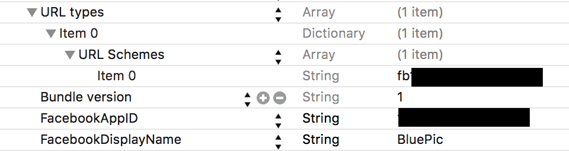
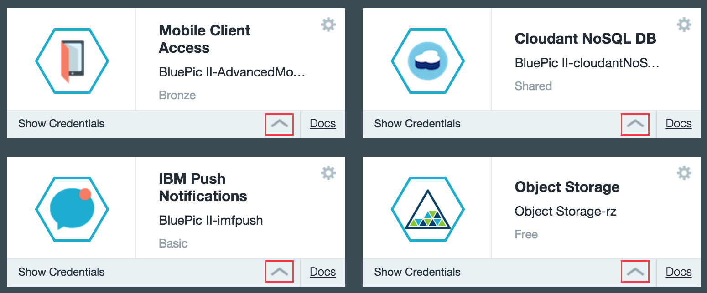
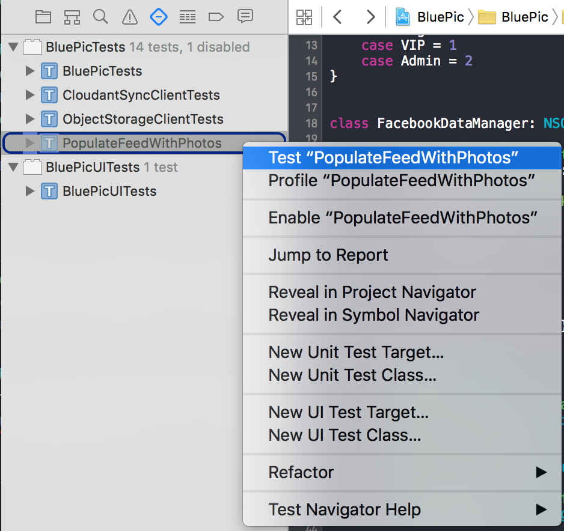
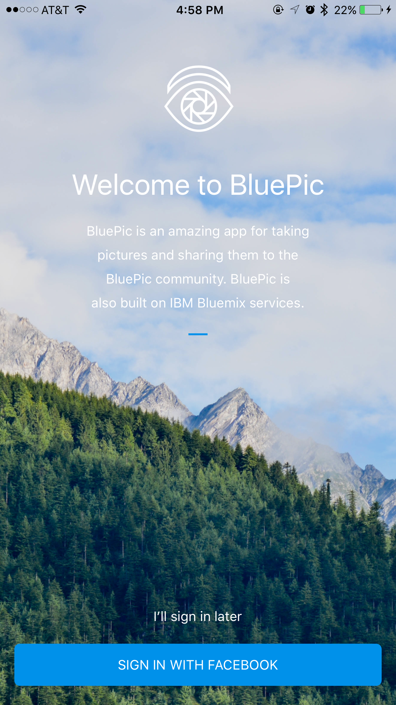
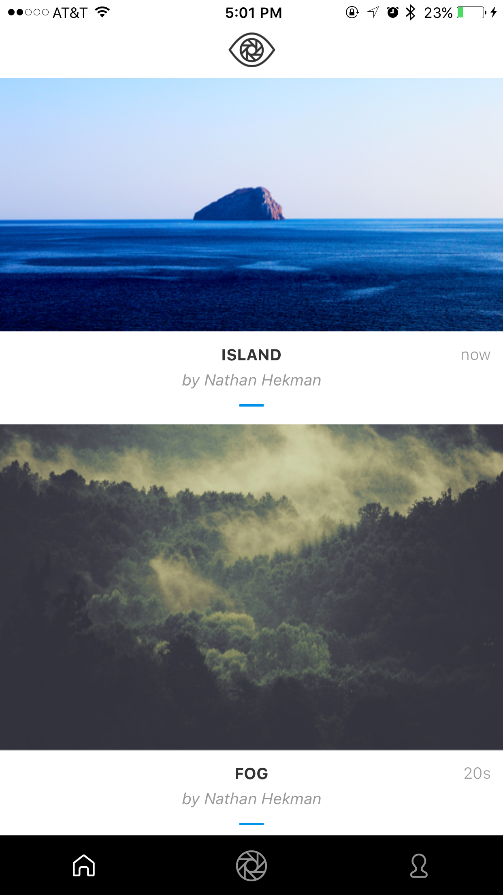
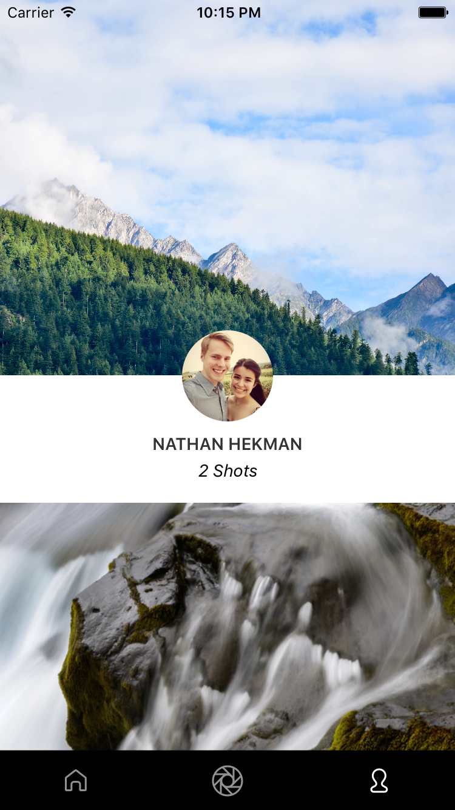
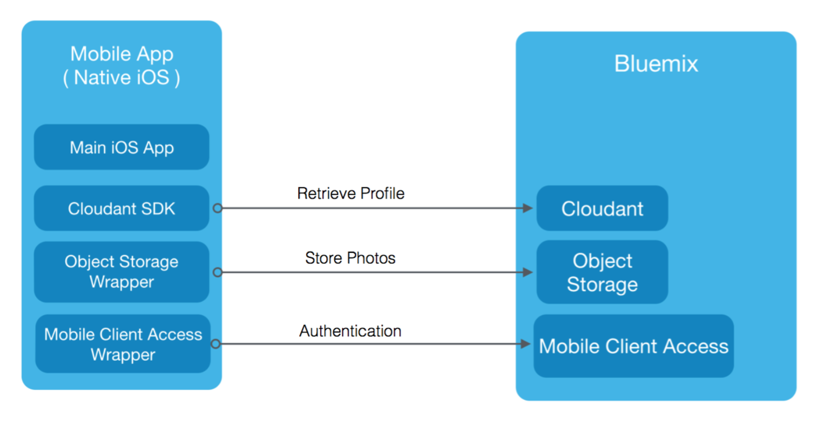
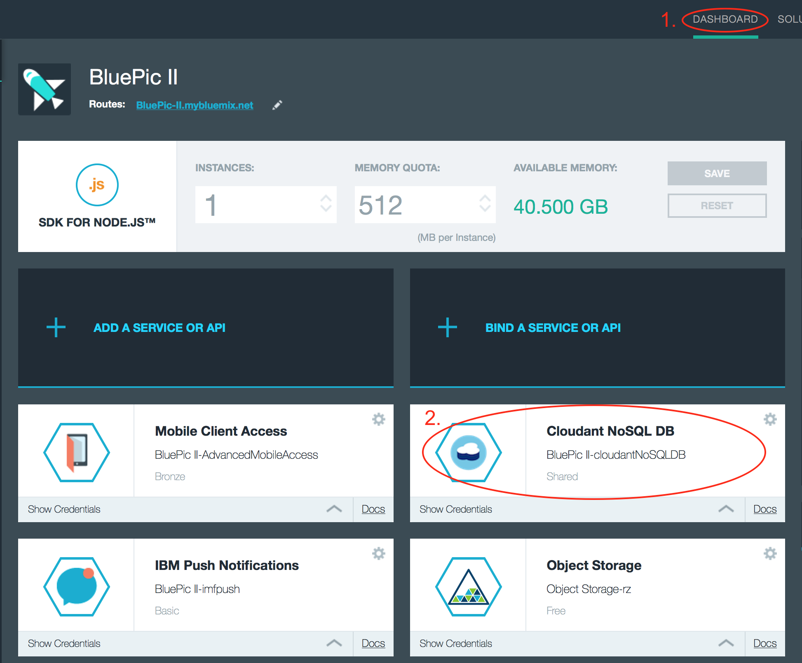
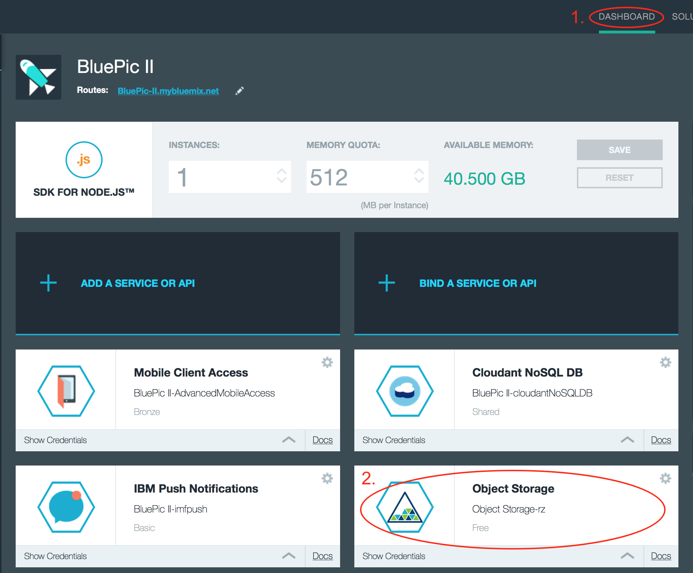

# BluePic

## Overview

BluePic is a sample application for iOS that shows how quickly and simple it is to get started developing with IBM Bluemix services. It is a photo sharing application that allows you to take photos and share them with anyone in the BluePic community.

<br>
## About IBM Bluemix

[Bluemix™](https://developer.ibm.com/sso/bmregistration?lang=en_US&ca=dw-_-bluemix-_-cl-bluemixfoundry-_-article) is the latest cloud offering from IBM®. It enables organizations and developers to quickly and easily create, deploy, and manage applications on the cloud. Bluemix is an implementation of IBM's Open Cloud Architecture based on Cloud Foundry, an open source Platform as a Service (PaaS). Bluemix delivers enterprise-level services that can easily integrate with your cloud applications without you needing to know how to install or configure them.

<br>
## Requirements
Currently, BluePic supports Xcode 7.1.1, iOS 9+, and Swift 2. Designed for iPhone, compatible with iPad.

<br>
## Project Structure
* `/BluePic-iOS` directory for the iOS client.
* `/BluePic-iOS/BluePic/Configuration` directory for configuring Bluemix services keys
* `/NodeStarterCode` directory for the server artifact that is deployed to Bluemix.
* `/img` directory for images for this README.

<br>
## Getting Started

### 1. Generate Bluemix Services
Click the Deploy to Bluemix button in order to create a Bluemix application on your account. It will automatically be set up with the required services. A DevOps Services project will also be created.

[](https://bluemix.net/deploy?repository=https://github.com/rolandoasmat/MyBluemixApp.git)

<br>
### 2. Create an application instance on Facebook
In order to authenticate, you must create an application instance on Facebook's website and connect it to your Bluemix app's Mobile Client Access by following the first two steps of [these instructions](https://www.ng.bluemix.net/docs/services/mobileaccess/security/facebook/t_fb_config.html). Make sure you are viewing the sample code in Swift by selecting the drop down at the top right of that page. 

<p align="center">
</p>

Basically, you need to create an app on your [Facebook Developers Portal](https://developers.facebook.com/quickstarts/?platform=ios). Then, replace the `FacebookAppID`, `FacebookDisplayName`, and `URL types` keys with your values in the `info.plist` under the `BluePic-iOS/BluePic/Configuration` directory.

<br>
### 3. Connect BluePic to your Bluemix Account
Next, take your specific keys for Cloudant NoSQL DB (**1** below), Mobile Client Access (labeled **2** in the figure below), and Object Storage (**3** below) from the Bluemix Application Dashboard, and copy them into `keys.plist` located in the `BluePic-iOS/BluePic/Configuration` directory.
<p align="center">
</p>
<p align="center">Bluemix Application Dashboard</p>

<p align="center">
</p>
<p align="center">keys.plist</p>

<br>
### 4. Optional - Pre-populate Feed with Stock Photos
Once BluePic is configured, you should be able to upload photos and see them appear on the feed and profile. However, initially your feed will be empty. If you would like to pre-populate your feed with 3 images, simply do the following:

1. With the BluePic Xcode project open, show the Test Navigator by clicking the 4th icon from the right of the Navigator (toolbar frame on the left side)
<p align="center">
</p>

1. Run the test called PopulateFeedWithPhotos which should be grayed out (disabled by default when tests are run) by right clicking it and clicking **Test "PopulateFeedWithPhotos"**.

1. The test should complete successfully. Launch BluePic again, and you should see 3 images added by user "Mobile Innovation Lab" on the feed.

<br>

## Using BluePic

### Facebook Login
BluePic was designed so that anyone can quickly launch the app and view photos posted without needing to log in. However, to view the profile or post photos, the user can easily login with his/her Facebook account. This is only used for a unique user id, as well as to display the user's profile photo.

<p align="center">
</p>

### View Feed
The feed (first tab) shows all the latest photos posted to the BluePic community (regardless if logged in or not).

<p align="center">
</p>

### Post a Photo
Posting to the BluePic community is easy. Tap the middle tab in the tab bar and choose to either Choose a photo from the Camera Roll or Take a photo using the device's camera. You can then give the photo a caption before posting.

<p align="center">
</p>

### View Profile
By tapping the third tab, you can view your profile. This shows your Facebook profile photo, lists how many photos you've posted, and shows all the photos you've posted to BluePic.

<p align="center">
</p>

<br>
## Architecture/Bluemix Services Implementation
The following architecture is utilized for BluePic. For authentication, Mobile Client Access with Facebook Authentication is implemented. For profile and photo metadata, the Cloudant SDK is integrated. Finally, to actually store user photos and host them in a container, Object Storage is utilized.

<p align="center">
</p>

### 1. Mobile Client Access Facebook Authentication
[Bluemix Mobile Client Access Facebook Authentication](https://www.ng.bluemix.net/docs/services/mobileaccess/gettingstarted/ios/index.html) is used for logging into BluePic. 

The `FacebookDataManager` under the `BluePic-iOS/BluePic/DataManagers` directory handles most of the code responsible for Facebook authentication. To start using Bluemix Facebook Authentication, it must first be configured on app launch, and we do this in the `didFinishLaunchingWithOptions()` method of `AppDelegate.swift` by calling the method below.

```swift
func initializeBackendForFacebookAuth() {
    //Initialize backend
    let key = Utils.getKeyFromPlist("keys", key: "backend_route")
    let guid = Utils.getKeyFromPlist("keys", key: "GUID")
    IMFClient.sharedInstance().initializeWithBackendRoute(key, backendGUID: guid);
    
    //Initialize FB
    IMFFacebookAuthenticationHandler.sharedInstance().registerWithDefaultDelegate()
    
    }
```

Also in the App Delegate, two other methods must be overridden to activate Facebook Authentication, as shown below:

```swift
func applicationDidBecomeActive(application: UIApplication) {
    FBAppEvents.activateApp()
    }
      
func application(application: UIApplication, openURL url: NSURL, sourceApplication: String?,annotation: AnyObject) -> Bool {
        return FBAppCall.handleOpenURL(url, sourceApplication:sourceApplication)
    }
```

Now that the Facebook and Bluemix frameworks are configured, you can actually try authenticating to receive a unique identifier for a user. The `FacebookDataManager` deals with authenticating and keeping track of user's credentials in a SharedInstance (singleton). The method below starts the process of showing a native Facebook login to the user when he/she presses the **SIGN IN WITH FACEBOOK** button on the `LoginViewController`.

```swift
/**
     Method to auth user using Facebook SDK
     
     - parameter callback: Success or Failure
     */
    func authenticateUser(callback : ((networkRequest : NetworkRequest) -> ())){
        if (self.checkIMFClient() && self.checkAuthenticationConfig()) {
            self.getAuthToken(callback) //this will in turn present FB login
        }
        else{
            callback(networkRequest: NetworkRequest.Failure)
        }
        
    }
```
The `self.checkAuthenticationConfig()` method call in the code above will try to present the native iOS 9 Safari Facebook Login Modal. The code above either continues with requesting a Facebook token if the login credentials were correct from the user, or throws an error if not correct or the user cancels.

After the user finishes inputting their credentials, the unique user id is received and saved in the `getAuthToken()` method of the `FacebookDataManager`. There, an IMFAuthorizationManager requests authorization by calling the `obtainAuthorizationHeaderWithCompletionHandler()` method, resulting in a success or failure. 

The successful closure of `getAuthToken()` is shown below, where the user display name and unique id are saved to the `sharedInstance` property of the `FacebookDataManager`, as well as saved to NSUserDefaults to keep track of log-in status in future app launches.

```swift
if let userID = identity["id"] as? NSString {
                        if let userName = identity["displayName"] as? NSString {
                        
                            //save username and id to shared instance of this class
                            self.fbUniqueUserID = userID as String
                            self.fbUserDisplayName = userName as String
                        
                            //set user logged in
                            self.isLoggedIn = true
                            
                            //save user id and name for future app launches
                            NSUserDefaults.standardUserDefaults().setObject(userID, forKey: "user_id")
                            NSUserDefaults.standardUserDefaults().setObject(userName, forKey: "user_name")
                            NSUserDefaults.standardUserDefaults().synchronize()
                            
                            print("Got facebook auth token for user \(userName) with id \(userID)")
                            
                            callback(networkRequest: NetworkRequest.Success)
                        }
                    }
```

<br>
### 2. Cloudant Sync (CDTDatastore)
Cloudant Sync [(CDTDatastore)](https://www.ng.bluemix.net/docs/services/mobileaccess/gettingstarted/ios/index.html) is used in BluePic for profile and picture metadata storage.

`CloudantSyncDataManager` was created to handle communicating between iOS and Cloudant Sync.

```swift
put sample code from BluePic here -- maybe show auth, push and pull? maybe create document?
```

You can view the Cloudant database (including profile and picture documents) by navigating to your Cloudant NoSQL DB service instance on the Bluemix Dashboard. To do this, navigate to your Bluemix Dashboard by clicking **Dashboard** on the top of your Bluemix home page (**#1** in the image below). Select your application. Then, click the **Cloudant NoSQL DB** service to view the record of images uploaded to each container (**#2** in the image below)

<p align="center">
</p>

<br>
### 3. Object Storage
[Object Storage](https://console.ng.bluemix.net/catalog/services/object-storage/) is used in BluePic for hosting images.

`ObjectStorageDataManager` and `ObjectStorageClient` were created based on [this link](http://developer.openstack.org/api-ref-objectstorage-v1.html) for communicating between iOS and Object Storage.

Before uploading photos, it is necessary to authenticate with Object Storage by calling `ObjectStorageDataManager.SharedInstance.objectStorageClient.authenticate()` which returns either a success or failure, shown below in the `FacebookDataManager`.

```swift
ObjectStorageDataManager.SharedInstance.objectStorageClient.authenticate({() in
                    print("success authenticating with object storage!")
                    self.showLoginIfUserNotAuthenticated()
                }, onFailure: {(error) in
                    print("error authenticating with object storage: \(error)")
                    DataManagerCalbackCoordinator.SharedInstance.sendNotification(DataManagerNotification.ObjectStorageAuthError)
            })
```

Next, you must create a container on Object Storage for uploading photos to. The method below in the `LoginViewModel` creates a container for later uploading photos to.

```swift
/**
     Method to attempt creating an object storage container and call callback upon completion (success or failure)
     
     - parameter userID: user id to be used for container creation
     */
    func createObjectStorageContainer(userID: String!) {
        print("Creating object storage container...")
        ObjectStorageDataManager.SharedInstance.objectStorageClient.createContainer(userID, onSuccess: {(name) in
            print("Successfully created object storage container with name \(name)") //success closure
            self.fbAuthCallback(true)
            }, onFailure: {(error) in //failure closure
                print("Facebook auth successful, but error creating Object Storage container: \(error)")
                self.fbAuthCallback(false)
        })
        
    }
```

Finally, you can upload an image to Object Storage by utilizing code similar to the method below in the `CameraDataManager`

```swift
    /**
     Method called to upload the image to object storage
     */
    func uploadImageToObjectStorage() {
        print("uploading photo to object storage...")
        //push to object storage
        ObjectStorageDataManager.SharedInstance.objectStorageClient.uploadImage(FacebookDataManager.SharedInstance.fbUniqueUserID!, imageName: self.lastPhotoTakenName, image: self.lastPhotoTaken,
            onSuccess: { (imageURL: String) in
                print("upload to object storage succeeded.")
                print("imageURL: \(imageURL)")
            }, onFailure: { (error) in
                print("upload to object storage failed!")
                print("error: \(error)")
				DataManagerCalbackCoordinator.SharedInstance.sendNotification(DataManagerNotification.ObjectStorageUploadError)
        })
    }
```

You can view the Object Storage database (including all photos uploaded) by navigating to your Object Storage service instance on the Bluemix Dashboard. To do this, navigate to your Bluemix Dashboard by clicking **Dashboard** on the top of your Bluemix home page (**#1** in the image below). Select your application. Then, click the **Object Storage** service to view the record of images uploaded to each container (**#2** in the image below)

<p align="center">
</p>


<br>
## Architecture Forethought

For BluePic, we used a simple architecture where there is no middle tier component between the mobile app and the storage components (e.g. Cloudant) on the server. To roll out BluePic to a production environment, a few architectural changes should be made.

Cloudant Sync requires a complete replica of the database on each mobile client. This may not be feasible for apps with large databases. Under such scenarios, instead of leveraging Cloudant Sync, the REST API provided by Cloudant could be used to perform CRUD and query operations against the remote Cloudant instance. Having said this, the Cloudant team is planning to introduce new capabilities [in 2016] for Cloudant Sync that should securely replicate subsets of a large remote database onto devices. Though replicating subsets of records can be done today with Cloudant Sync, doing so with large databases where only a small subset of records should be replicated can introduce performance problems. New functionality that is expected to be delivered next year by the Cloudant team should address such performance issues. 

Using Cloudant Sync without an additional middle tier component between the mobile app and the database requires the mobile code to know the username and password for accessing the Cloudant database. This will lead to security breaches if someone gets their hands on those credentials. Hence, security could be a reason for having all database operations go first through a middleware component (e.g. Liberty, Node.js) to verify that only authenticated and authorized users of the app can perform such operations. In this architecture, the credentials to access the database are only known by the middleware component.

<br>
## License
